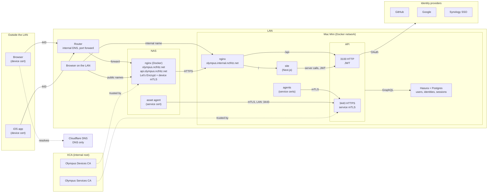
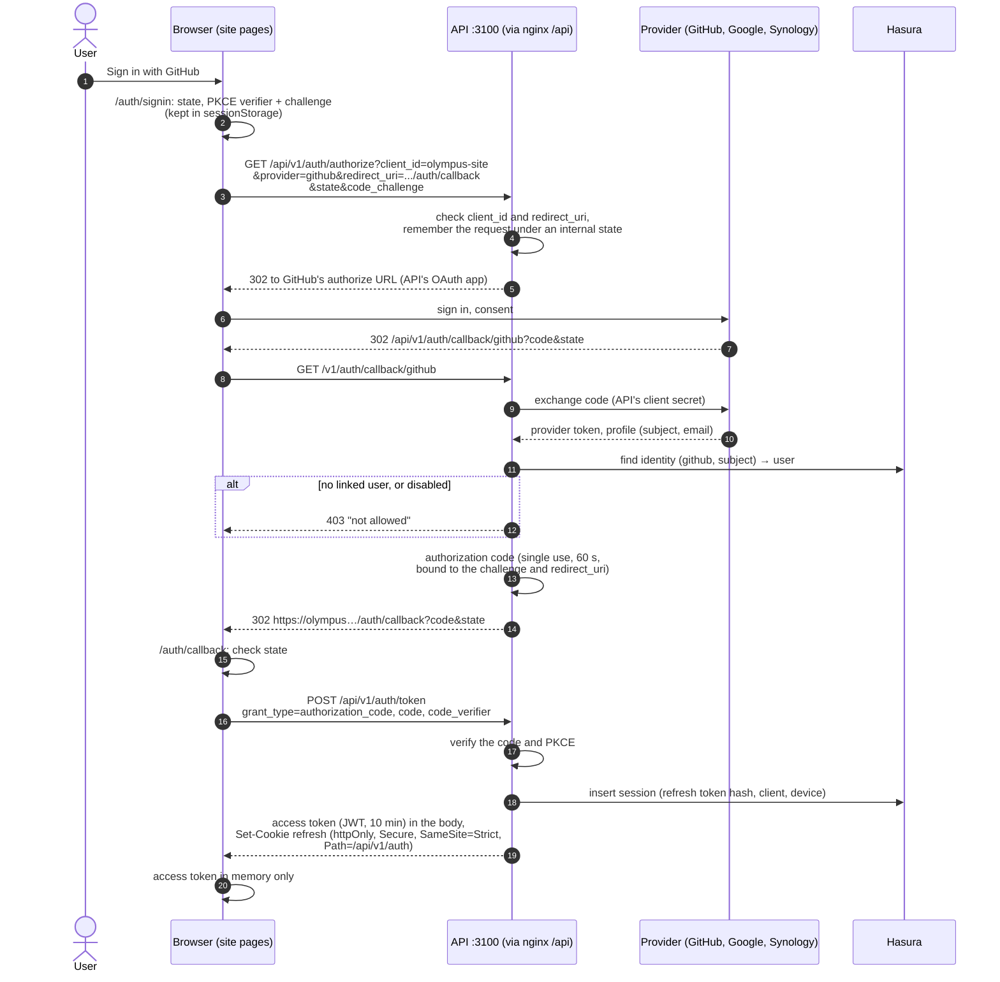
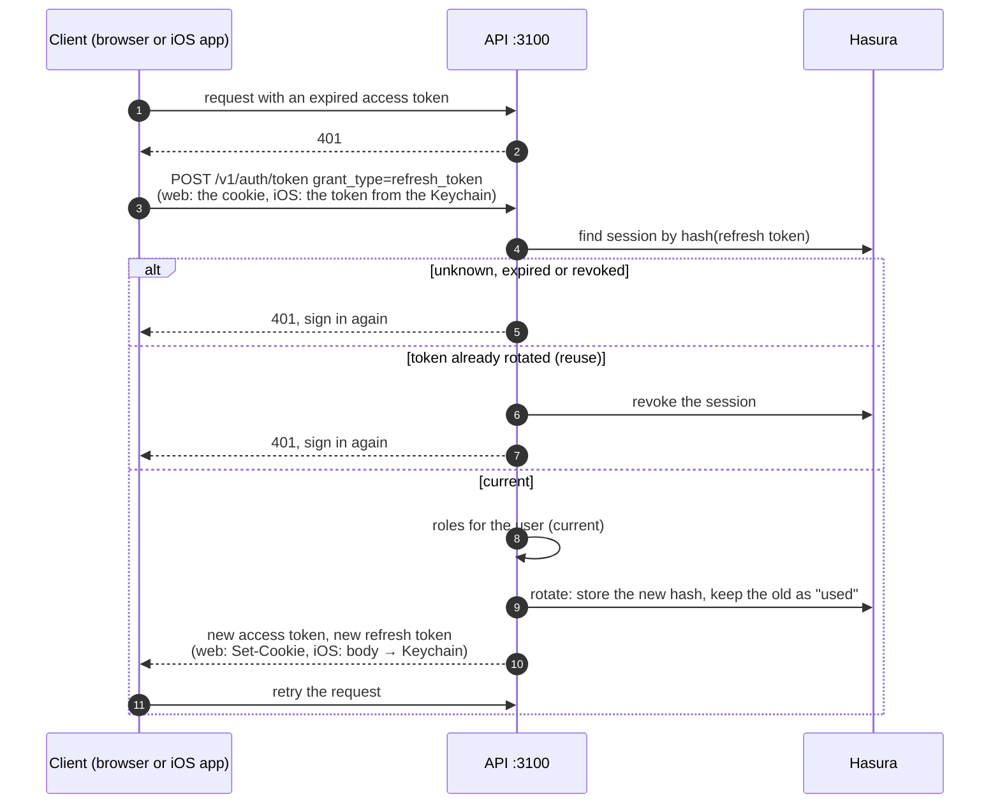
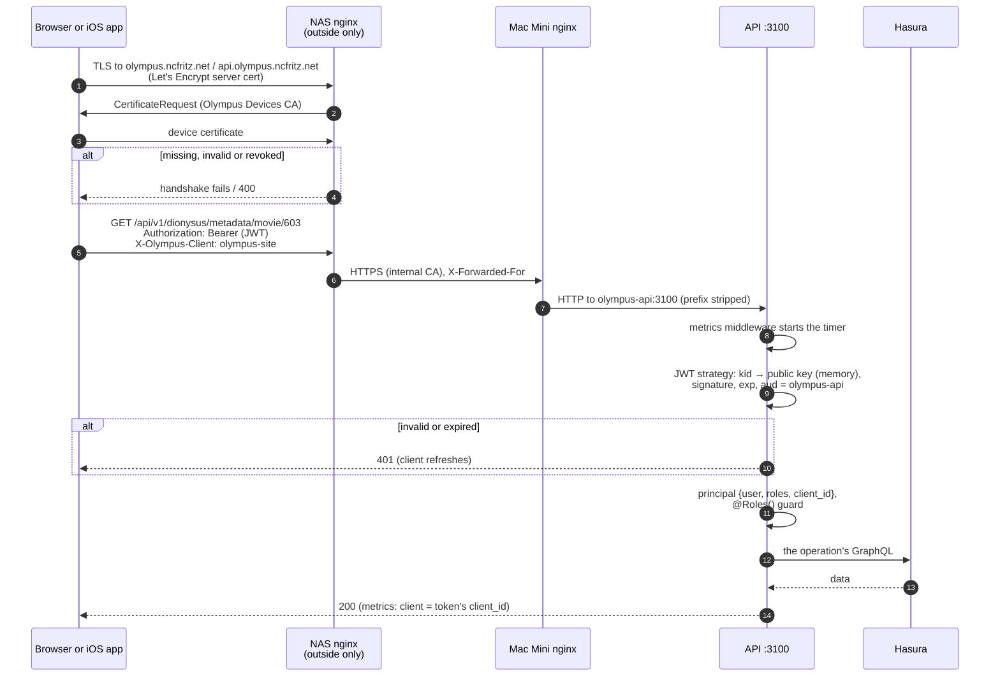
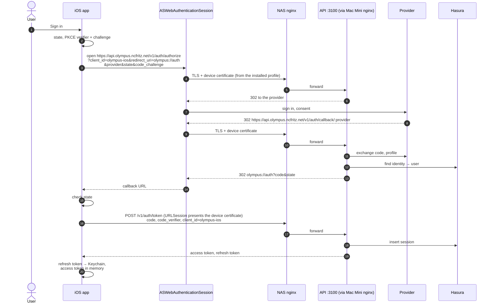
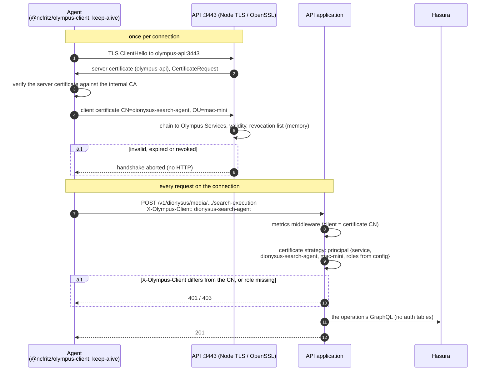
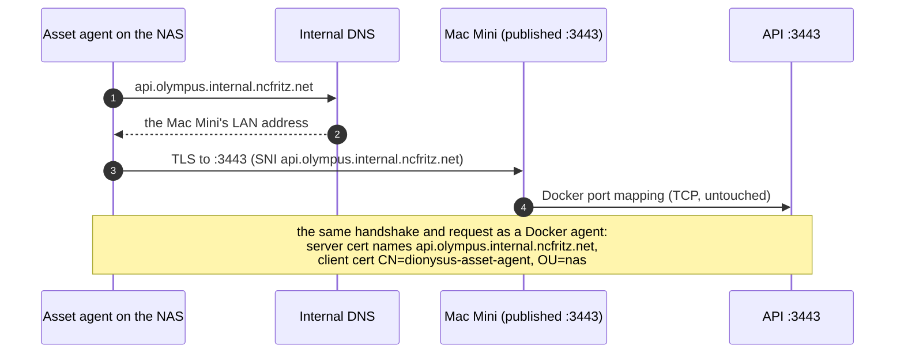
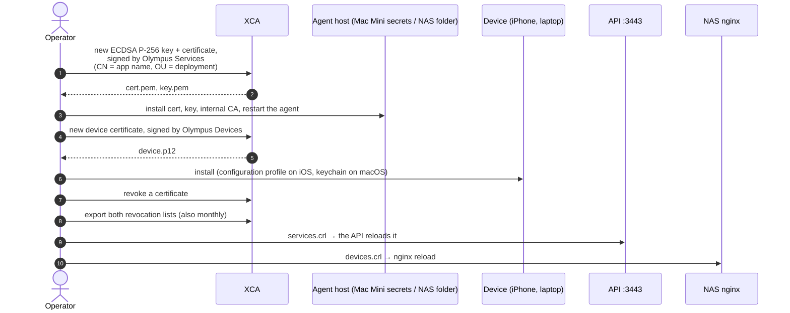

# 0018. Authentication for users, devices and services

- **Status:** Accepted
- **Date:** 2026-09-20

## Context

The API has no authentication. The site signs users in with NextAuth
(GitHub only) but sends the API nothing; agents call it with no
credentials; only the content-auth cookie gates some Dionysus content.
The platform is about to be reachable from outside the LAN, and an iOS
app will call the API.

The callers differ:

- **Web users**, on the LAN and outside it, through the site.
- **iOS (and desktop) apps**, outside the LAN, calling the API directly.
- **Agents on the Mac Mini**, on the same Docker network as the API,
  some with long-running, high-throughput workflows.
- **The asset agent on the NAS**, which runs a subset of the handlers
  and is not on that Docker network.

The audience is small; installing a certificate on each person's device
is acceptable. Certificates are issued by hand in XCA for now. Nothing
may depend on a cloud service.

## Decision

### Hosts

| Host                               | Runs on                   | TLS                                                          | Serves                                                  |
| ---------------------------------- | ------------------------- | ------------------------------------------------------------ | ------------------------------------------------------- |
| `olympus.internal.ncfritz.net`     | Mac Mini nginx            | internal CA                                                  | the site; `/api` → API `3100`                           |
| `olympus.ncfritz.net`              | NAS nginx (Docker)        | Let's Encrypt; **device certificate required**               | forwards to `https://olympus.internal.ncfritz.net`      |
| `api.olympus.ncfritz.net`          | NAS nginx (Docker)        | Let's Encrypt; **device certificate required**               | forwards to `https://olympus.internal.ncfritz.net/api/` |
| `api.olympus.internal.ncfritz.net` | the API itself (no nginx) | internal CA; **service certificate required** (Node, `3443`) | the API, for agents outside Docker                      |

- Cloudflare resolves the two public names to the router, **DNS only**
  (not proxied, which would end TLS before the NAS). The router forwards
  the public port to the NAS nginx, which renews the Let's Encrypt
  certificates.
- The internal DNS also resolves the public names to the NAS, so devices
  take the same path, device certificate included, at home and away.

### The API's two listeners

| Listener | Protocol                                                          | Reached by                                                                                                          | Identity                     |
| -------- | ----------------------------------------------------------------- | ------------------------------------------------------------------------------------------------------------------- | ---------------------------- |
| `3100`   | HTTP, Docker network only                                         | the Mac Mini nginx, the site's server                                                                               | a JWT the API issued (users) |
| `3443`   | HTTPS; a client certificate from **Olympus Services** is required | Docker agents (`olympus-api:3443`); the NAS (`api.olympus.internal…:3443`, published on the Mac Mini's LAN address) | the certificate (services)   |

- Identity comes only from what the API verified itself: a signature on
  `3100`, a certificate chain on `3443`. No listener trusts an identity
  header, so nothing can be forged by skipping a proxy.
- `3443` is a second Node HTTPS server over the same application. OpenSSL
  checks the chain and the revocation list during the handshake, from
  memory; a connection without a valid certificate never reaches HTTP.
  Agents keep connections alive, so the handshake is paid once per
  connection, and certificates use ECDSA P-256.
- A route is either public (`@Public()`), for users (`3100`), or for
  services (`3443`); roles are checked with `@Roles()`. The principal is
  `{ kind: "user", userId, roles, client }` or
  `{ kind: "service", name, deployment, roles }`.
- The `client` label of the request metrics (ADR 0017) comes from the
  verified identity: the token's `client_id` on `3100`, the certificate's
  CN on `3443`.

### Certificates (XCA)

- Two intermediates under the internal root, both ECDSA P-256:
  - **Olympus Services** signs agent certificates: CN is the app name
    (`dionysus-asset-agent`), OU the deployment (`mac-mini`, `nas`).
    Only the API's `3443` trusts it.
  - **Olympus Devices** signs personal devices (iPhone, laptops). Only
    the NAS nginx trusts it.

  A device certificate can't act as an agent, an agent certificate
  doesn't pass the border, and each is revoked separately.

  > **Amended by [ADR 0023](0023-service-certificates-are-checked-by-issuer.md).**
  > The two issuing CAs are siblings under one parent, so a trust store
  > that terminates at the root accepts either. The API checks the
  > certificate's issuer; the paragraph above describes the intent, not
  > what the chain enforces on its own. 0023 also corrects the number of
  > revocation lists below.

- Revocation lists for both are exported from XCA on every revocation and
  at least monthly. A verifier checks every authority in the chain, so it
  needs the root's list as well as the intermediate's: the API loads them
  as separate files (Node reads only the first list in a file) and
  reloads them with `setSecureContext()` when they change; nginx takes
  both in one file (`ssl_crl`) and reloads.
- The API's `3443` server certificate names `olympus-api` and
  `api.olympus.internal.ncfritz.net`.
- Later: the internal CA
  ([ADR 0020](0020-internal-certificate-authority.md)) replaces manual
  issuance, with the same intermediates and relying parties: ACME,
  renewal and published revocation lists.
- **Escrowed keys.** A device (or service) that cannot generate its own
  key gets one generated by the CA, which keeps it encrypted so the
  certificate can be exported again, as PKCS#12 for an iOS profile or a
  browser. CSR enrollment stays the preference. An export is for
  `pki-admin` only, with a reason, a recent sign-in (`auth_time`, below)
  and an audit record; an escrowed key is deleted when its certificate
  is revoked. Until the internal CA exists, XCA's database is the escrow:
  it already keeps the keys it generated.

### Users and tokens

The API is the authorization server for its own clients, `olympus-site`
and `olympus-ios`:

- Sign-in with GitHub, Google or Synology SSO (OIDC). The API is the
  OAuth client of each provider; a user is allowed when an identity is
  linked to a user in the `users` table.
- The authorization-code flow with PKCE for every client
  (`/v1/auth/authorize`, `/v1/auth/callback/:provider`,
  `/v1/auth/token`). Codes are single-use and live 60 seconds.
- Access tokens: JWTs signed with ES256, 10 minutes, with `sub` (user),
  `client_id`, `aud` (`olympus-api`), `roles`, `auth_time` and `kid`.
  `auth_time` is when the session's provider sign-in completed; refresh
  carries it unchanged, so an operation can require a recent sign-in
  (exporting an escrowed key) and a client meets it by running the
  sign-in flow again, which starts a new session. The public keys
  are served at `/.well-known/jwks.json`; the private keys come from a
  secret file, never the database, and rotate by `kid`.
- Refresh tokens: opaque, 30 days, stored only as a hash in `sessions`,
  rotated on every use. Presenting a rotated token again revokes the
  whole session (reuse detection). The site keeps it in an httpOnly,
  `Secure`, `SameSite=Strict` cookie scoped to `/api/v1/auth`; the iOS
  app in the Keychain.
- Checking a request's token needs no database: the signature is checked
  against the public keys in memory, and roles are in the token. A role
  change or revocation takes effect at the next refresh, within the
  access token's 10 minutes.

### Data

`users`, `user_identities` (provider, subject → user) and `sessions`
(refresh token hash, client, device, expiry, rotation, revocation) are
Hasura tables, the first migration of the migrations workflow (ADR 0006),
whose baseline comes first. Only login, refresh and logout touch them;
services never do. Service roles come from the API's configuration
(certificate CN → roles).

## Diagrams

### Overview

### Web sign-in

The same on the LAN and outside it; outside, the NAS nginx first
requires the device certificate (see "A user's API request"). The site's
pages run the flow in the browser as a public client; the site needs no
server routes, and the refresh token never reaches JavaScript.

### Token refresh

### A user's API request

### iOS sign-in

### An agent's API request (Docker)

### The NAS agent's API request

### Issuing and revoking certificates

## Consequences

- Services never touch the auth tables or Hasura to authenticate; users
  touch them only at sign-in, refresh and sign-out. Checking a request
  costs a signature check or nothing beyond the TLS handshake.
- The API handles TLS for agents. OpenSSL does the work; keep-alive and
  ECDSA keep handshakes rare and cheap.
- Everything outside the LAN needs a device certificate first. Adding a
  person or device means issuing and installing one; losing a device
  means revoking its certificate and its sessions.
- A role change or revocation reaches users within ten minutes, not
  immediately.
- The site drops NextAuth. Each provider needs redirect URIs for the API
  on `olympus.internal…`, `olympus.ncfritz.net` and
  `api.olympus.ncfritz.net`; Synology SSO works where DSM is reachable.
- The iOS sign-in depends on `ASWebAuthenticationSession` presenting the
  profile-installed device certificate; prove it with a test build before
  the app depends on it.
- The minimal Hasura migrations baseline (phase 4) now comes before this
  work.

## Implementation

The phases, the testers and the functional sign-off are in
[docs/plans/authentication](../plans/authentication/README.md). In short:

1. **Foundations.** This ADR accepted; the minimal Hasura migrations
   baseline; the `users`, `user_identities` and `sessions` migration.
2. **Auth in the API.** Principals, `@Public()`, `@Roles()` and a global
   guard in report-only mode (logs what it would reject); the `3443`
   listener (HTTPS over the same app, revocation list reload, CN →
   roles); the `client` metrics label from the verified identity.
3. **Tokens.** Provider sign-in (GitHub, Google, Synology OIDC); the
   authorization-code flow with PKCE; refresh with rotation and reuse
   detection; sign-out and the session list; the key set and JWKS; rate
   limits on the auth endpoints; the JWT strategy on `3100`.
4. **Clients.** `@ncfritz/olympus-client`: Node TLS options (certificate,
   key, CA, keep-alive) for agents, and an auth option (access token,
   refresh and retry once on 401) for the site and apps. The site swaps
   NextAuth for the API's flow; the Socket.IO handshake checks the JWT.
5. **Agents.** One commit per agent onto `3443`, the NAS asset agent onto
   `api.olympus.internal.ncfritz.net:3443`; the XCA runbook.
6. **Border.** The NAS nginx configuration (Let's Encrypt, device
   certificates, forwarding), the Mac Mini nginx, published ports and DNS,
   in `infra/`. Then the guard stops reporting and enforces.
7. **Later.** The internal CA (ADR 0020) for ACME, renewal and escrow; the iOS app on the client package.

Development mirrors production: a script creates a throwaway root with
both intermediates, the API's `3443` certificate and agent and device
certificates; the dev compose runs the API with both listeners and an
nginx standing in for the NAS.
