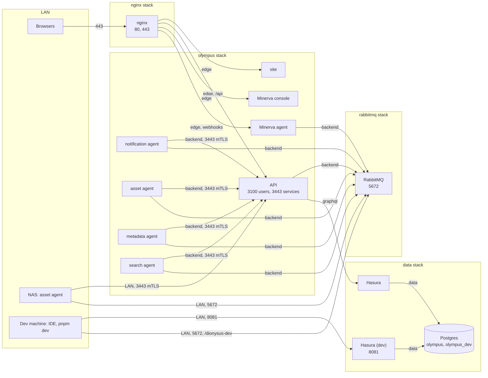

# 0019. Compose stacks, configuration and secrets

- **Status:** Accepted
- **Date:** 2026-09-21

## Context

Olympus runs on the Mac Mini as seven Compose projects kept outside any
repository (`postgres`, `hasura`, `rabbitmq`, `nginx`, `olympus`,
`dionysus`, and `minerva` still to come), plus a monitoring stack
(Grafana, Loki, Prometheus) that the services join. The asset agent also
runs on the NAS. An audit of the current files
([plan](../plans/docker/README.md#the-current-stack)) found:

- **Secrets are baked into the images.** Every Dockerfile copies the whole
  build context, including `production.env`, and starts with
  `node --env-file=production.env`. Anyone with an image has that
  service's passwords, and a registry (ADR 0011) would hand them out.
- **Postgres and Hasura are open to the LAN** with trivial credentials,
  and Hasura runs with its console and dev mode on. Anything on the LAN
  can read and write every table without going through the API, which
  makes the authentication work (ADR 0018) moot until it is closed.
- **Nothing is pinned**: every image is `latest`, including Postgres over
  a bind-mounted data directory, where a pull across a major version
  leaves the database unable to start.
- **Nothing is reproducible from the repository.** The compose files,
  host paths and configuration exist only on the Mac Mini, and fixed
  `container_name`s mean a second copy (a dev environment) cannot run on
  the same host.
- The Olympus and Dionysus services have no restart policy, no health
  checks and no log rotation.

The goals:

- Reproduce the whole platform on another host from the repository, a
  directory of secrets and a backup.
- A full local stack on the dev laptop, for working away from the home
  lab.
- In the home lab, run any one service from the IDE against dev
  infrastructure on the Mac Mini, without running Postgres, Hasura,
  RabbitMQ or nginx locally.

## Decision

### Four stacks

| Stack      | Services                                                                                                                                             | Lifecycle                                                |
| ---------- | ---------------------------------------------------------------------------------------------------------------------------------------------------- | -------------------------------------------------------- |
| `data`     | Postgres, Hasura, and in the home lab a second Hasura for dev                                                                                        | Stateful; deployed when the schema changes               |
| `rabbitmq` | RabbitMQ                                                                                                                                             | Stateful; rarely touched                                 |
| `nginx`    | nginx                                                                                                                                                | Shared with things that are not Olympus                  |
| `olympus`  | API, site, notification agent, the Dionysus asset, metadata and search agents, the Minerva calendar agent (its SQLite store on a volume) and console | Redeployed with every code change; state only on volumes |

Each is one Compose project from `infra/docker/compose/<stack>.yml`, so
each restarts on its own. Compose's `include:` is not used: it merges
files into one project, which is what separate lifecycles rule out.
`infra/docker/stack.sh` brings them up in order when a whole host is
built.

Monitoring (Grafana, Loki, Prometheus) is a separate concern, shared by
more than Olympus: it stays out of this repository, and the services
join its network.

### Hosts

The same compose files run on every host; what differs is a value in
`infra/docker/env/<host>.env`: image tags, published ports, host paths
and hostnames. These files hold no secrets and are committed, so a host
is described by the repository.

| Host       | Runs                                                                                          | Env file           |
| ---------- | --------------------------------------------------------------------------------------------- | ------------------ |
| Mac Mini   | Production: all four stacks, and `hasura-dev` in the data stack                               | `env/mac-mini.env` |
| Dev laptop | A full local stack: `data` and `rabbitmq`, optionally `nginx` and `olympus` from local images | `env/laptop.env`   |
| NAS        | `compose/nas.yml`: the asset agent alone, its handlers chosen in the env file                 | `env/nas.env`      |

Services run from the IDE read the workspace env files that already
exist: `dev.env` (`pnpm dev`) points at the home lab's dev endpoints,
`local.env` (`pnpm dev:local`) at the laptop's.

- No `container_name`: services are addressed by service name, and
  Compose names containers after the project.
- Networks have fixed names (`olympus-data`, ...), are created once by
  `stack.sh bootstrap`, and are declared `external` in every file, so no
  stack depends on another having started first.
- **Dev joins no production network but one.** `hasura-dev` shares
  `data` with Postgres to reach its own database; nothing on `data`
  resolves `hasura`, so the two instances cannot be confused. Everything
  else dev uses on the Mac Mini, it reaches through a published port.

### Networks

| Network                | Members                                     | Carries                                  |
| ---------------------- | ------------------------------------------- | ---------------------------------------- |
| `data`                 | Postgres, Hasura, Hasura (dev)              | SQL                                      |
| `graphql`              | Hasura, API                                 | GraphQL: the API is Hasura's only client |
| `backend`              | RabbitMQ, API, every agent                  | AMQP; agents to the API's `3443`         |
| `edge`                 | nginx, site, API, Minerva agent and console | What nginx proxies                       |
| (monitoring, external) | everything that exports metrics or logs     | Prometheus scrapes, Loki pushes          |

Postgres is reachable only from the two Hasura instances, and
production's Hasura only from the API.

### Published ports

Only what another machine needs:

| Port              | Bound to  | Why                                                 |
| ----------------- | --------- | --------------------------------------------------- |
| nginx 80, 443     | LAN       | The site, the API under `/api`, the Minerva console |
| API 3443          | LAN       | The NAS asset agent (ADR 0018)                      |
| RabbitMQ 5672     | LAN       | The NAS asset agent; services run from the IDE      |
| Hasura (dev) 8081 | LAN       | The API run from the IDE, and its console           |
| Postgres 5432     | 127.0.0.1 | Tools on the host; an SSH tunnel from elsewhere     |
| Hasura 8080       | 127.0.0.1 | `hasura console` and `migrate` from the CLI         |
| RabbitMQ 15672    | 127.0.0.1 | The management UI                                   |

The site, the API's `3100` and every metrics port are reached over
Docker networks. The laptop publishes the same set on 127.0.0.1.

### Images

- **Ours** come from the local registry (ADR 0011) as
  `${REGISTRY}/olympus/<name>:${OLYMPUS_TAG}`, where the tag is the git
  commit set in the host's env file. A deploy changes the tag; a rollback
  changes it back.
- **Hasura** is our own image: `hasura/graphql-engine:v2.39.1.cli-migrations-v3`
  with `infra/hasura`'s migrations and metadata copied in, so deploying
  an image applies the schema it was built with, and no stack
  bind-mounts anything from a checkout.
- **RabbitMQ** is our own image from `infra/docker/rabbitmq/`: the
  management image plus the delayed-message, consistent-hash and
  Prometheus plugins, the plugin's download checked against its checksum.
  It stays on the 4.1 series: the delayed-message plugin, which carries
  every `x-delay` retry, is no longer maintained and can't follow
  RabbitMQ to 4.3, which drops the Mnesia store it keeps messages in.
- **Third-party** images are pinned to an exact version: Postgres at the
  major version its data directory was created with, nginx at a stable
  release.
- **No configuration in images.** `.dockerignore` excludes `*.env`, and
  no `CMD` reads an env file.

### Configuration and secrets

- Non-secret settings are `environment:` entries in the compose file,
  interpolated from the host's env file with `${NAME:?}` so a missing
  value stops the deploy instead of starting a service with an empty one.
  Code defaults cover the rest.
- Secrets are Compose file secrets: files in `${SECRETS_DIR}` on the
  host (outside the repository, readable by the Docker user only),
  mounted at `/run/secrets/<name>`. Each file's top-level `secrets:` is
  the list of what a host must provide; `stack.sh check` reports any that
  are missing.
- Services read them as `<NAME>_FILE`: `EnvReader` in
  `@ncfritz/olympus-nest` accepts either `NAME` or `NAME_FILE`, so every
  service gets it at once and plain variables keep working in the
  workspace. Postgres reads `POSTGRES_PASSWORD_FILE` natively; the Hasura
  image's entrypoint exports its `_FILE`s before starting the engine.
- RabbitMQ's users, vhosts and permissions come from a definitions file
  (a secret: it holds password hashes). Each service gets its own user,
  limited to its vhost, instead of every service sharing `admin`.
- Certificates and keys for mTLS (ADR 0018) are secrets too.

### Every service

A shared `x-service` fragment gives each of our services
`restart: unless-stopped`, `init: true` (the asset agent's ffmpeg and
HandBrake children are reaped and receive signals), log rotation
(`json-file`, 10 MB × 5), `no-new-privileges` and `cap_drop: [ALL]`, and
a health check against a public `GET /health`. File logging inside
containers is off: Docker's log and Loki already have it. The asset
agent gets CPU and memory limits, since a transcode can otherwise take
the host.

Health checks order services within a stack. Across stacks there is no
ordering: a service that starts before RabbitMQ or Hasura is ready exits,
and its restart policy retries it.

### Hasura in production

Console and dev mode off. Migrations are written with the CLI's
`hasura console` against `hasura-dev` (or the laptop's instance), and
reach production only as part of an image. `HASURA_GRAPHQL_DATABASE_URL` is set, which the
repository's metadata requires: its source reads the connection from
that variable instead of storing the password.

### Dev

**In the home lab**, nothing runs locally but the service being worked on.

- Postgres holds a second database, `olympus_dev`, owned by an
  `olympus_dev` role that can connect to nothing else. It starts as a
  restore of production's latest backup.
- `hasura-dev` is a second instance of the same Hasura image, in the data
  stack on its own tag (`HASURA_DEV_TAG`), with `olympus_dev` as both its
  data and its metadata database. Each instance keeps its metadata in its
  own database, so the two never share a catalog. A schema change is
  deployed to `hasura-dev` first and tried there; production follows by
  moving its tag. It is published to the LAN with its own admin secret;
  its data is a copy of production's, so it is as sensitive.
- `hasura-dev` serves the console (below).
- RabbitMQ is shared: dev services connect as a user whose permissions
  cover only `/dionysus-dev`.
- The API, agents and site run from the IDE with `pnpm dev`. The site's
  dev server proxies `/api` to the local API, so nginx isn't needed.

**On the laptop**, away from the home lab, the same compose files run
with `env/laptop.env`: `data` (Postgres with one database, one Hasura)
and `rabbitmq`, plus `nginx` and `olympus` when wanted, from images built
locally (`docker buildx bake --load`, never pushed). Services run from
the IDE with `pnpm dev:local`. The data is a restore of a backup; the
secrets are the laptop's own, never production's. What the laptop can't
reach away from home, the NAS's SSH and NZBGet, leaves the asset and
download handlers idle there.

**The console in dev.** `hasura-dev` and the laptop's Hasura serve the
console (`HASURA_GRAPHQL_ENABLE_CONSOLE`, with dev mode for detailed
errors), for inspecting data and trying queries; production's never
does. What changes the schema still goes through the CLI's
`hasura console`, which writes migrations and metadata into
`infra/hasura`:

- The image applies the repository's metadata when it starts, so a
  restart or a redeploy replaces anything tracked, permitted or renamed
  in the served console.
- A table or column made there stays in `olympus_dev` but exists nowhere
  else, and the next restore from production removes it.

Standing the laptop up from the repository, a secrets directory and a
backup is also the rehearsal for a new host.

### Deploying

`infra/docker/stack.sh <stack> <up|down|pull|check>` wraps
`docker compose -p <stack> -f compose/<stack>.yml --env-file
env/$OLYMPUS_HOST.env`. Because no stack bind-mounts files from the
checkout (host paths are absolute paths on the Docker host), it works on
the host itself or from another machine with `DOCKER_CONTEXT` set, as
ADR 0011 intends.

### Data

Bind mounts stay under `${DATA_DIR}`, so today's data is used in place.
Postgres is backed up nightly with `pg_dump` per database, and RabbitMQ's
definitions exported, to the NAS. Refreshing `olympus_dev` and the
laptop from those backups is the restore drill.

## Diagram

Production on the Mac Mini by stack and network, with the home lab's
dev path:

## Consequences

- A host is the repository, a secrets directory, a data directory and
  the registry. Standing one up is `stack.sh bootstrap`, then `up` for
  each stack; `check` names any missing secret before anything starts.
- Rotating a password is replacing a file and restarting a service, not
  rebuilding an image.
- Deploying the Hasura image applies migrations and metadata. A schema
  change ships with the code that needs it and rolls back with it (the
  down migration permitting).
- Dev shares the Mac Mini's Postgres and RabbitMQ but not their data: its
  own database and role, its own vhost and user. A mistake in dev can
  load the shared servers but not write to production's tables or
  queues.
- A schema change is tried on `hasura-dev` with the same image that
  production will run.
- Moving containers means new names: Prometheus scrape targets and
  anything else that used `olympus-api-server`, `hasura-server` or
  `rabbitmq-server` changes with the cutover.
- Every Dockerfile is rewritten (ADR 0011's build work), since none builds
  in the monorepo today.

## Open

- Whether `env/*.env` stays committed if the repository is ever public:
  it names internal hosts.
- AMQP to the NAS crosses the LAN unencrypted (credentials included);
  TLS on 5671 when that link is next touched.
- Replacing the delayed-message exchange, most likely with per-delay
  queues that dead-letter back when their TTL expires, before any
  RabbitMQ upgrade past 4.2.

## Implementation

[docs/plans/docker/README.md](../plans/docker/README.md).
