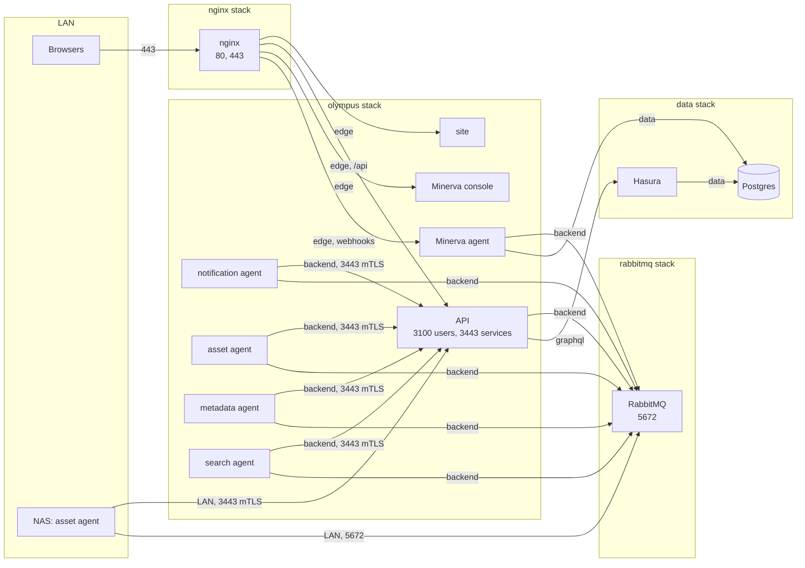

# 0019. Compose stacks, configuration and secrets

- **Status:** Proposed
- **Date:** 2026-09-21

## Context

Olympus runs on the Mac Mini as seven Compose projects kept outside any
repository (`postgres`, `hasura`, `rabbitmq`, `nginx`, `olympus`,
`dionysus`, and `minerva` still to come), plus a monitoring stack
(Grafana, Loki, Prometheus) that the services join. The asset agent also
runs on the NAS. An audit of the current files
([plan](../plans/docker/README.md#the-current-stack)) found:

- **Secrets are baked into the images.** Every Dockerfile copies the whole
  build context, including `production.env`, and starts with
  `node --env-file=production.env`. Anyone with an image has that
  service's passwords, and a registry (ADR 0011) would hand them out.
- **Postgres and Hasura are open to the LAN** with trivial credentials,
  and Hasura runs with its console and dev mode on. Anything on the LAN
  can read and write every table without going through the API, which
  makes the authentication work (ADR 0018) moot until it is closed.
- **Nothing is pinned**: every image is `latest`, including Postgres over
  a bind-mounted data directory, where a pull across a major version
  leaves the database unable to start.
- **Nothing is reproducible from the repository.** The compose files,
  host paths and configuration exist only on the Mac Mini, and fixed
  `container_name`s mean a second copy (a dev environment) cannot run on
  the same host.
- The Olympus and Dionysus services have no restart policy, no health
  checks and no log rotation.

The goals are to reproduce the whole platform on another host from the
repository plus a directory of secrets, and to run a dev environment
next to production in which one service can be worked on without
rebuilding the others.

## Decision

### Four stacks

| Stack      | Services                                                                                                              | Lifecycle                                    |
| ---------- | --------------------------------------------------------------------------------------------------------------------- | -------------------------------------------- |
| `data`     | Postgres, Hasura                                                                                                      | Stateful; deployed when the schema changes   |
| `rabbitmq` | RabbitMQ                                                                                                              | Stateful; rarely touched                     |
| `nginx`    | nginx                                                                                                                 | Shared with things that are not Olympus      |
| `olympus`  | API, site, notification agent, the Dionysus asset, metadata and search agents, the Minerva calendar agent and console | Stateless; redeployed with every code change |

Each is one Compose project from `infra/docker/compose/<stack>.yml`, so
each restarts on its own. Compose's `include:` is not used: it merges
files into one project, which is what separate lifecycles rule out.
`infra/docker/stack.sh` brings them up in order when a whole host is
built. The monitoring stack stays outside the repository for now; the
services join its network.

### Environments are project names

`prod` and `dev` run the same files. Everything that differs between
them, or between hosts, is a value in `infra/docker/env/<host>.<env>.env`:
image tags, published ports, host paths and hostnames. These files hold
no secrets and are committed, so a host is described entirely by the
repository.

- No `container_name`: services are addressed by service name, and
  Compose prefixes containers with the project (`olympus-dev-api-1`).
- Network names come from the environment (`olympus-data`,
  `olympus-dev-data`), created once by `stack.sh bootstrap`, and
  declared `external` in every file, so no stack depends on another
  having started first.
- **No network is shared between environments.** Compose registers each
  service's name on every network it joins, so a dev `api` and a prod
  `api` on one network would answer to the same name. Where dev uses a
  shared service (RabbitMQ, nginx, monitoring), it goes through a
  published port.

### Networks

| Network                | Members                                     | Carries                                  |
| ---------------------- | ------------------------------------------- | ---------------------------------------- |
| `data`                 | Postgres, Hasura, Minerva agent             | SQL                                      |
| `graphql`              | Hasura, API                                 | GraphQL: the API is Hasura's only client |
| `backend`              | RabbitMQ, API, every agent                  | AMQP; agents to the API's `3443`         |
| `edge`                 | nginx, site, API, Minerva agent and console | What nginx proxies                       |
| (monitoring, external) | everything that exports metrics or logs     | Prometheus scrapes, Loki pushes          |

Postgres is reachable only from Hasura and the Minerva agent, and Hasura
only from the API.

### Published ports

Only what another machine needs:

| Port           | Bound to  | Why                                                 |
| -------------- | --------- | --------------------------------------------------- |
| nginx 80, 443  | LAN       | The site, the API under `/api`, the Minerva console |
| API 3443       | LAN       | The NAS asset agent (ADR 0018)                      |
| RabbitMQ 5672  | LAN       | The NAS asset agent                                 |
| Postgres 5432  | 127.0.0.1 | Tools on the host; an SSH tunnel from elsewhere     |
| Hasura 8080    | 127.0.0.1 | `hasura console` and `migrate` from the CLI         |
| RabbitMQ 15672 | 127.0.0.1 | The management UI                                   |

The site, the API's `3100` and every metrics port are reached over
Docker networks. Dev publishes its own set on 127.0.0.1 only.

### Images

- **Ours** come from the local registry (ADR 0011) as
  `${REGISTRY}/olympus/<name>:${OLYMPUS_TAG}`, where the tag is the git
  commit set in the host's env file. A deploy changes the tag; a rollback
  changes it back.
- **Hasura** is our own image: `hasura/graphql-engine:v2.39.1.cli-migrations-v3`
  with `infra/hasura`'s migrations and metadata copied in, so deploying
  an image applies the schema it was built with, and no stack
  bind-mounts anything from a checkout.
- **RabbitMQ** stays a custom image (today's `ncfritz/rabbitmq`), built
  by the bake file from a pinned base.
- **Third-party** images are pinned to an exact version: Postgres at the
  major version its data directory was created with, nginx at a stable
  release.
- **No configuration in images.** `.dockerignore` excludes `*.env`, and
  no `CMD` reads an env file.

### Configuration and secrets

- Non-secret settings are `environment:` entries in the compose file,
  interpolated from the host's env file with `${NAME:?}` so a missing
  value stops the deploy instead of starting a service with an empty one.
  Code defaults cover the rest.
- Secrets are Compose file secrets: files in `${SECRETS_DIR}` on the
  host (outside the repository, readable by the Docker user only),
  mounted at `/run/secrets/<name>`. Each file's top-level `secrets:` is
  the list of what a host must provide; `stack.sh check` reports any that
  are missing.
- Services read them as `<NAME>_FILE`: `EnvReader` in
  `@ncfritz/olympus-nest` accepts either `NAME` or `NAME_FILE`, so every
  service gets it at once and plain variables keep working in the
  workspace. Postgres reads `POSTGRES_PASSWORD_FILE` natively; the Hasura
  image's entrypoint exports its `_FILE`s before starting the engine.
- RabbitMQ's users, vhosts and permissions come from a definitions file
  (a secret: it holds password hashes). Each service gets its own user,
  limited to its vhost, instead of every service sharing `admin`.
- Certificates and keys for mTLS (ADR 0018) are secrets too.

### Every service

A shared `x-service` fragment gives each of our services
`restart: unless-stopped`, `init: true` (the asset agent's ffmpeg and
HandBrake children are reaped and receive signals), log rotation
(`json-file`, 10 MB × 5), `no-new-privileges` and `cap_drop: [ALL]`, and
a health check against a public `GET /health`. File logging inside
containers is off: Docker's log and Loki already have it. The asset
agent gets CPU and memory limits, since a transcode can otherwise take
the host.

Health checks order services within a stack. Across stacks there is no
ordering: a service that starts before RabbitMQ or Hasura is ready exits,
and its restart policy retries it.

### Hasura in production

Console and dev mode off. The console is used through the CLI
(`hasura console`) against the port on 127.0.0.1, which is also how
migrations are written. `HASURA_GRAPHQL_DATABASE_URL` is set, which the
repository's metadata requires: its source reads the connection from
that variable instead of storing the password.

### Dev

- **Infra.** RabbitMQ and nginx are shared with production: dev
  connects to RabbitMQ through its published port as a user whose
  permissions cover only `/dionysus-dev`, and nginx serves dev under its
  own server names, proxying to dev's published ports. Postgres and
  Hasura are a separate `data-dev` project: Hasura metadata belongs to an
  instance, so migrations and metadata must be tried somewhere other than
  production. `data-dev` starts from a restore of production's latest
  backup.
- **The Olympus stack.** `olympus-dev` runs every service from images
  built locally (`docker buildx bake --load <target>`, tag `dev`, never
  pushed). To work on one, stop its container and run it from the
  workspace with `pnpm dev`; the workspace's `dev.env` points at dev's
  published ports. When the service being worked on is the API, the
  agents are pointed at `host.docker.internal` by one variable in the dev
  env file.

### Deploying

`infra/docker/stack.sh <env> <stack> <up|down|pull|check>` wraps
`docker compose -p <project> -f compose/<stack>.yml --env-file
env/<host>.<env>.env`. Because no stack bind-mounts files from the
checkout (host paths are absolute paths on the Docker host), it works on
the Mac Mini itself or from another machine with `DOCKER_CONTEXT` set,
as ADR 0011 intends.

### Data

Bind mounts stay under `${DATA_DIR}`, so today's data is used in place.
Postgres is backed up nightly with `pg_dump` per database, and RabbitMQ's
definitions exported, to the NAS. Standing up `data-dev` from those
backups is the restore drill.

## Diagram

Production on the Mac Mini, by stack and network:

## Consequences

- A host is the repository, a secrets directory, a data directory and
  the registry. Standing one up is `stack.sh bootstrap`, then `up` for
  each stack; `check` names any missing secret before anything starts.
- Rotating a password is replacing a file and restarting a service, not
  rebuilding an image.
- Deploying the Hasura image applies migrations and metadata. A schema
  change ships with the code that needs it and rolls back with it (the
  down migration permitting).
- Dev and prod on one host cannot reach each other except through the
  ports each publishes, and dev's RabbitMQ user cannot touch production's
  vhost.
- Moving containers means new names: Prometheus scrape targets and
  anything else that used `olympus-api-server`, `hasura-server` or
  `rabbitmq-server` changes with the cutover.
- Every Dockerfile is rewritten (ADR 0011's build work), since none builds
  in the monorepo today.

## Open

- **Dev's data tier.** This record gives dev its own Postgres and Hasura
  and shares RabbitMQ and nginx; confirm, or share Postgres with a
  separate database.
- **Minerva's store.** A `minerva` database in the shared Postgres (backed
  up with everything else) or SQLite on a volume.
- Whether `env/*.env` stays committed if the repository is ever public:
  it names internal hosts.
- The monitoring stack joins the repository later, with the monitoring
  work.

## Implementation

[docs/plans/docker/README.md](../plans/docker/README.md).
