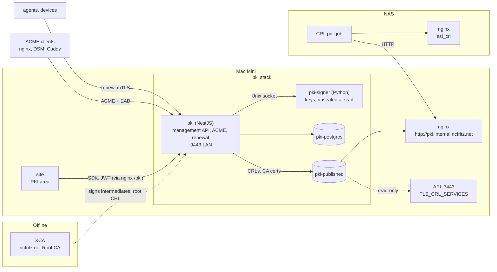
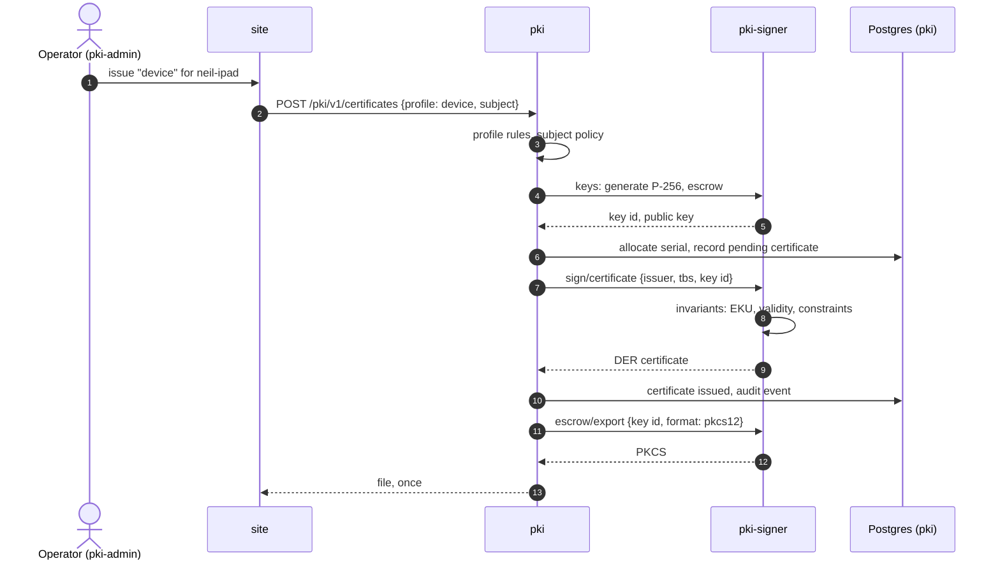
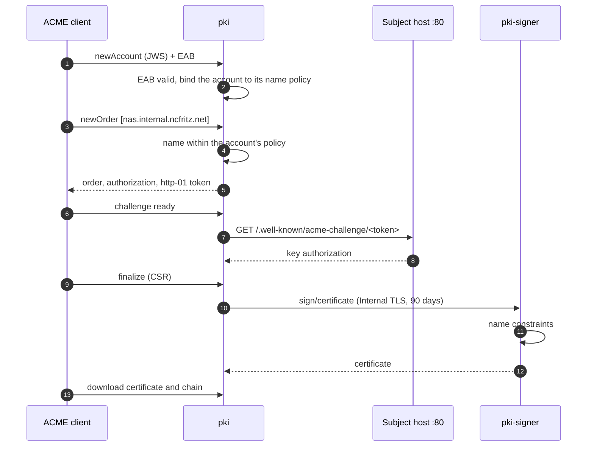

# 0020. An internal certificate authority: PKI service and signer

- **Status:** Proposed
- **Date:** 2026-09-21

## Context

Every certificate behind ADR 0018 is issued by hand in XCA
([runbook](../guides/certificates.md)): keys generated on a laptop,
revocation lists exported on every revocation and at least monthly, and
nothing renewed unless someone remembers. ADR 0018 named step-ca as the
later replacement. What is needed from it:

- Private key generation and management, CSR generation and signing,
  renewal, revocation lists, and ACME for anything that can speak it.
- A UI for managing issuers, profiles, certificates and ACME accounts,
  and an API documented with OpenAPI, like the rest of the platform.
- Everything local; nothing depends on a cloud service.

What was found (September 2026):

- **step-ca's revocation is passive by design**: revoking a certificate
  blocks its renewal and it stays valid until it expires. Revocation
  lists are secondary and there is no OCSP responder. Every relying
  party here (the API's `3443`, the NAS nginx) checks a revocation list,
  so step-ca would be the wrong fit for the part that matters most.
- **Issuance is well served in Node**: `@peculiar/x509` and `pkijs` are
  maintained and cover keys, CSRs, certificates and extensions. The gaps
  are PKCS#12 export (legacy `node-forge`) and assembling signed CRLs and
  OCSP responses from primitives.
- **Python's `cryptography`** has first-class builders for certificates,
  CSRs, CRLs, OCSP responses and PKCS#12 (including the legacy
  encryption some devices require).
- **No maintained ACME server library exists in either language.** The
  Node packages are clients; `@peculiar/acme-server` was last published
  in April 2024. The ACME server is ours to write.
- The internal zone is served by the router, which has no API for TXT
  records, so ACME's `dns-01` challenge is not available for internal
  names.
- The one device on the LAN with unusual needs is the HP Color LaserJet
  Pro MFP M479fdw: HP's embedded web server is known to be particular
  about imported PKCS#12 files (key type, encryption, whether the chain
  is included).

## Decision

### Build it; two services

The CA is ours, split so that private keys live in one small process
that makes almost no decisions:

| Service      | Language         | Holds                                           | Does                                                                    |
| ------------ | ---------------- | ----------------------------------------------- | ----------------------------------------------------------------------- |
| `pki`        | NestJS           | Metadata: issuers, profiles, certificates, ACME | Management API, ACME, renewal, policy, CRL scheduling and publication   |
| `pki-signer` | Python (FastAPI) | Private keys, encrypted                         | Generate keys, sign certificates and CRLs, export PKCS#12; nothing else |

`pki` never sees a private key except one it is handing to the operator
once (see Enrollment). `pki-signer` never decides _whether_ a certificate
should exist, only whether it breaks one of its own invariants.

This is a new top-level domain, **PKI** (`docs/conventions/general.md`:
new domains get an ADR). Its OpenAPI document is `/pki`.

**The signer is the one exception to "TypeScript everywhere".** It is kept
small enough to read in a sitting, because Python's `cryptography` is
materially ahead for the revocation lists, PKCS#12 and (later) OCSP this
design depends on, and because the boundary is the point: a narrow
signing API is what an HSM would give us, drawn in software.

### The signer

- **Transport: a Unix socket**, on a volume only `pki` and the signer
  mount. No network listener at all, so nothing else on any Docker
  network can reach it, and there is no certificate to bootstrap before
  the CA exists. A shared token (a Compose secret) is checked as well.
- **API**: `status`, `unseal`, `seal`, `keys` (generate; import),
  `sign/certificate`, `sign/crl`, `escrow/export`. Inputs are fully
  formed: subject, extensions, validity, serial and the public key or
  CSR. It has its own OpenAPI document; `pki` calls it through a
  generated client that is not part of `packages/sdk`.
- **Invariants it enforces itself**, whatever `pki` asks:
  - The issuer's name constraints, checked against every name in the
    request.
  - A maximum validity per issuer, and never past the issuer's own
    expiry.
  - The extended key usages each issuer may sign (below).
  - `CA:TRUE` is refused: every online issuer has path length 0.
- **Storage**: its own SQLite file on its own volume. Keys are never in
  Postgres, and a dump of the platform database holds nothing that signs.

### Key protection: encrypted, unsealed automatically

- Each private key is encrypted with its own data key (AES-256-GCM). The
  data keys are wrapped by a master key, and the master key is wrapped
  twice:
  - by the **unseal key**, 32 random bytes in a Compose secret
    (`pki_signer_unseal_key`, ADR 0019) that only the signer mounts;
  - by a **recovery passphrase** (Argon2id), kept in the password
    manager and nowhere on the host.
- **The signer unseals itself at start** with the unseal key, so the CA
  survives an unattended reboot of the Mac Mini. If the secret is missing
  or wrong it starts sealed and alerts, and the recovery passphrase
  unseals it (UI or CLI).
- **Sealing is deliberate**: `seal` (a suspected compromise, a lost
  backup) forgets the keys and records the seal in the store, so the
  signer stays sealed across restarts until it is unsealed with the
  recovery passphrase. The unseal key alone does not undo it.
- While sealed, issuance, renewal, ACME finalisation and CRL signing
  return `503`; scheduled CRL signing retries and alerts. Everything
  read-only keeps working.
- Rotating the unseal key or the passphrase rewraps the master key;
  nothing else changes.
- **The cost**: whoever can read both the Mac Mini's secrets directory
  and the signer's volume has the online issuers, as they would have the
  API's signing keys (ADR 0018) today. What bounds it: the store and the
  unseal key are never in the same backup; Internal TLS is
  name-constrained; the root stays offline and can revoke and reissue
  every intermediate. Losing the passphrase is harmless while the unseal
  key exists; losing both loses the online intermediates, which the root
  reissues.

### Hierarchy

The root stays **offline in XCA**. It signs intermediates and its own
revocation list, a few times a decade.

| Issuer                       | Status                           | Signs                                                       | Extended key usage | Trusted by                      |
| ---------------------------- | -------------------------------- | ----------------------------------------------------------- | ------------------ | ------------------------------- |
| **Olympus Services**         | Existing; key imported from XCA  | Service identities; the API's `3443` certificate            | client, server     | The API's `3443` (clients)      |
| **Olympus Devices**          | Existing; key imported from XCA  | People's devices                                            | client             | The NAS nginx                   |
| **ncfritz.net Internal TLS** | New; key generated in the signer | Server certificates for internal hosts, via ACME or by hand | server             | Everything that trusts the root |

- **Internal TLS is name-constrained**: permitted DNS subtrees
  `internal.ncfritz.net` (and the LAN's IP ranges); everything else is
  excluded. The root is installed on laptops and phones; a constrained
  issuer cannot mint `google.com` even if the Mac Mini is lost.
- It is separate from Olympus Services so an ACME-issued certificate,
  which anything on the LAN may request under its account's policy, can
  never be presented to the API's `3443` as a service.
- The two existing intermediates are not name-constrained and cannot
  become so without reissuing them and everything they signed; that is
  left for their renewal (Open).
- The Internal TLS key is generated in the signer; only its CSR leaves,
  to be signed by the root in XCA.
- Everything is ECDSA P-256, as ADR 0018 set. Subject keys may be RSA
  where a device requires it (the printer).

### Profiles

A profile is what a certificate may be: issuer, key type, key usage and
extended key usage, subject and SAN rules, validity, enrollment mode and
export format. Every issuance names one. Initial set:

| Profile         | Issuer           | Key      | Validity | Enrollment             | Notes                                                                  |
| --------------- | ---------------- | -------- | -------- | ---------------------- | ---------------------------------------------------------------------- |
| `service`       | Olympus Services | P-256    | 1 year   | CSR or generated       | CN = app name, OU = deployment (ADR 0018)                              |
| `api-server`    | Olympus Services | P-256    | 1 year   | CSR or generated       | The API's `3443`                                                       |
| `device`        | Olympus Devices  | P-256    | 1 year   | generated              | PKCS#12 for iOS profiles and browsers                                  |
| `internal-tls`  | Internal TLS     | P-256    | 90 days  | ACME, CSR or generated | Renewed at 60 days                                                     |
| `legacy-device` | Internal TLS     | RSA 2048 | 1 year   | generated              | The printer: PKCS#12 without the chain, legacy (SHA-1/3DES) encryption |

### Enrollment and escrow

Two modes, per profile:

- **CSR** (preferred): the subscriber generates its key and submits a
  CSR. The CA never has the key.
- **Generated, and escrowed**: the signer generates the key, the
  certificate is issued, and the key is kept, wrapped by its own data
  key like the issuers' keys. It can be exported again (PKCS#12 or PEM)
  by someone holding `pki-admin`, with a reason, after a recent sign-in
  (the access token's `auth_time`, ADR 0018), and recorded in the audit
  log. This is for devices that cannot generate a
  CSR, or where re-downloading a lost file matters more than the key
  never having existed outside the device.

Escrowed keys are subject to the seal like everything else, and are
deleted when their certificate is revoked or has been expired for a
year.

### Serials, revocation and publication

- **Serials** are 159 random bits (positive, 20 bytes), allocated in the
  transaction that records the certificate, with a unique constraint.
  Certificates imported from XCA keep theirs.
- **Revocation lists** are signed per issuer, numbered monotonically
  (continuing from XCA's last number), valid for **7 days** and
  republished **daily** and on every revocation. An expired list is
  treated as no list, so expiry, not corruption, is the failure to
  design against.
- **Publication** writes the DER list and the issuer's certificate to a
  `pki-published` volume, then fetches it back through the distribution
  URL and verifies the signature before recording it as published. A
  failure alerts.
- **Distribution**: the Mac Mini nginx serves that volume at
  `http://pki.internal.ncfritz.net/crl/<issuer>.crl` and
  `/ca/<issuer>.crt`. Plain HTTP on purpose (fetching a CRL must not
  depend on a certificate the CA issued), no authentication, no
  redirects. The URLs are written into every new certificate (CRL
  distribution point, authority information access), so the name is
  dedicated and outlives the host: it moves with the CA if the CA moves.
- **Relying parties keep reading files**, as ADR 0018 set:
  - The API mounts `pki-published` read-only and points
    `TLS_CRL_SERVICES` at the Services and root lists; it already
    reloads them when they change.
  - The NAS pulls the Devices and root lists from the distribution URL
    on a schedule, checks the signatures, concatenates them for
    `ssl_crl`, and reloads nginx. Pull, so the CA needs no credentials
    for the NAS.
- **The root's list** is signed in XCA with a 13-month validity, once a
  year and whenever an intermediate is revoked, and uploaded to `pki`,
  which verifies it against the root and publishes it with the rest.
- OCSP is not provided; every relying party is ours and uses lists.

### Renewal

- **Services and devices** renew over mutual TLS: presenting a current,
  unrevoked certificate from the same issuer to `POST /v1/renew` on
  `9443`,
  with a CSR (or with none, for an escrowed key), returns a certificate
  with the same subject. `pki` checks status from its own records, not
  a revocation list.
- **ACME** subscribers renew as ACME clients do.
- **Hand-issued** certificates (the printer) are listed by expiry in the
  UI, and `certificate_expiry_days` covers everything the CA has issued.

### ACME

RFC 8555, implemented in `pki` (NestJS, `jose` for JWS), for the Internal
TLS issuer only.

- Directory at `https://pki.internal.ncfritz.net:9443/acme/directory`;
  accounts, orders, authorizations, `http-01` and `tls-alpn-01`
  challenges, finalisation, certificate download and revocation. Nonces
  are a table with a short expiry.
- **External Account Binding is required.** An EAB credential is created
  in the UI and carries a name policy (the names or subtrees its
  account may request). Without it, anything on the LAN that can reach
  the endpoint could obtain a certificate for any internal name, and the
  root is trusted by every browser in the house.
- An order is checked against its account's policy before any challenge
  is created; the signer checks the name constraints again at signing.
- `dns-01` is not offered until the internal zone, or a delegated
  `_acme-challenge` zone, has an API (Open).
- Checked against certbot, lego, acme.sh and Caddy, which each exercise
  different corners of the protocol.

### Surfaces

| Surface        | Where                                              | Auth                                                           | Documented          |
| -------------- | -------------------------------------------------- | -------------------------------------------------------------- | ------------------- |
| Management API | nginx → `pki`, `/pki/v1/...`                       | JWT from the API (ADR 0018), roles `pki-admin`, `pki-operator` | OpenAPI `/pki`; SDK |
| Renewal        | `pki` `:9443`, `/v1/renew`                         | Client certificate                                             | OpenAPI `/pki`      |
| ACME           | `pki` `:9443`, `/acme/...`                         | JWS; EAB at registration                                       | RFC 8555            |
| Distribution   | Mac Mini nginx, `http://pki.internal.ncfritz.net/` | None                                                           | This ADR            |
| Signer         | Unix socket                                        | Shared token                                                   | Internal OpenAPI    |

- The management API is proxied by the Mac Mini nginx under `/pki` on
  the site's host, as the API is under `/api`, so the site calls it the
  same way on the LAN and through the border.
- ACME and renewal are on `9443`: HTTPS with a certificate from Internal
  TLS, asking for (not requiring) a client certificate; each route
  decides what it accepts. Published on the LAN directly, like the API's
  `3443`, because renewal needs the client certificate a proxy would
  end.
- `pki` verifies users' JWTs against the API's JWKS; it does not issue
  tokens or touch the auth tables.
- **Break-glass**: CLIs inside the containers can unseal, issue and
  revoke without the site or the API, so an expired certificate on the
  API can always be replaced.

### Data

`pki` keeps its own Postgres, a container in the `pki` stack, with
migrations in Prisma (as Minerva calendar sync does). It is not the data
stack's Postgres, is not tracked by Hasura, and the API is not its
client.

- The CA issues the API's own certificates, so it must not depend on
  the API or Hasura to do so.
- ADR 0019 keeps Postgres on `data` reachable only from Hasura; a
  separate instance leaves that rule alone and puts the CA's whole state
  (database and signer store) in one stack, backed up together.
- ADR 0007 holds: tables, columns, foreign keys and constraints; no JSON
  documents in rows.
- Tables: `issuers`, `profiles`, `certificates` (serial, issuer,
  profile, subject, SANs, validity, status, key location), `revocations`,
  `crls` (number, this and next update, published at), `enrollments`,
  `escrow_exports`, `acme_accounts`, `acme_eab_credentials`,
  `acme_name_policies`, `acme_orders`, `acme_authorizations`,
  `acme_challenges`, `acme_nonces`, `audit_events`.

### UI

A PKI area in `apps/site` (Next.js, AntD, `packages/ui`), on the SDK like
every other area: the seal state and unseal; issuers and their CRLs;
certificates (search, detail, chain, issue, renew, revoke, export);
profiles; ACME accounts and EAB credentials; the audit log.

### Deployment

- The Mac Mini, in a fifth Compose stack, `pki` (ADR 0019): `pki`,
  `pki-signer` and `pki-postgres`, a private network, the signer's store
  and socket volumes, and `pki-published` shared with nginx and the API.
  Separate from `olympus` so a platform deploy never restarts, and so
  never seals, the CA.
- `pki` joins `edge`, so nginx can proxy the management API.
- Backups: the signer's SQLite file (encrypted keys) and the `pki`
  database, together; the XCA database, as today. The unseal key is not
  in that backup: it lives in the host's secrets and, with the recovery
  passphrase, in the password manager.
- A second host later changes where the stack runs and what
  `pki.internal.ncfritz.net` resolves to, nothing else.

## Diagrams

### Overview

### Issuing with an escrowed key

### ACME order

## Consequences

- Revocation becomes routine: revoke in the UI and every relying party
  has the new list within minutes (the API) or one pull interval (the
  NAS). The monthly export by hand goes away.
- Internal servers get ACME, and services and devices get renewal
  without XCA. Adding a device is an issuance in the UI.
- The platform gains a Python service, with its own toolchain in the
  monorepo (`uv`, `ruff`, `pyright`, `pytest`, wired into Turbo tasks),
  and a conventions document for it.
- Writing the ACME server is the largest single piece of work.
- The CA shares the Mac Mini with what it vouches for: losing that host
  loses both. Accepted for now; a second host moves the `pki` stack.
- A restart of the host needs nobody: the signer unseals itself. The CA
  being sealed (the secret missing, or a deliberate seal) is visible, a
  metric and an alert, not silent.
- The runbook ([certificates](../guides/certificates.md)) is rewritten for
  the UI; XCA remains only for the root.
- Replaces ADR 0018's "later: step-ca" item. The rest of ADR 0018
  stands: the same intermediates, relying parties and file-based
  revocation lists.

## Open

- Name constraints on Olympus Services and Olympus Devices when they are
  next reissued.
- `dns-01`: delegate `_acme-challenge.internal.ncfritz.net` to an
  acme-dns instance, or move the internal zone off the router.
- Device enrollment for iOS by SCEP in a configuration profile, instead
  of a PKCS#12 file.
- The printer's firmware: which key types and PKCS#12 encryption it
  accepts, confirmed on the device before `legacy-device` is settled.
- ACME Renewal Information (RFC 9773), once a client that matters uses
  it.
- A hardware key store (a YubiKey or PKCS#11 token) behind the signer's
  key interface.
- A mythological name for the domain, like its siblings.

## Implementation

The phases are in [docs/plans/internal-ca](../plans/internal-ca/README.md).

## References

- https://smallstep.com/docs/step-ca/revocation/
- https://datatracker.ietf.org/doc/html/rfc8555
- https://cryptography.io/en/latest/x509/reference/
- https://github.com/PeculiarVentures/x509
