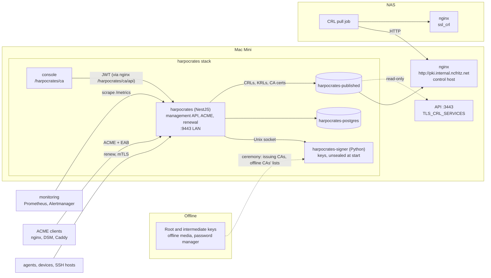
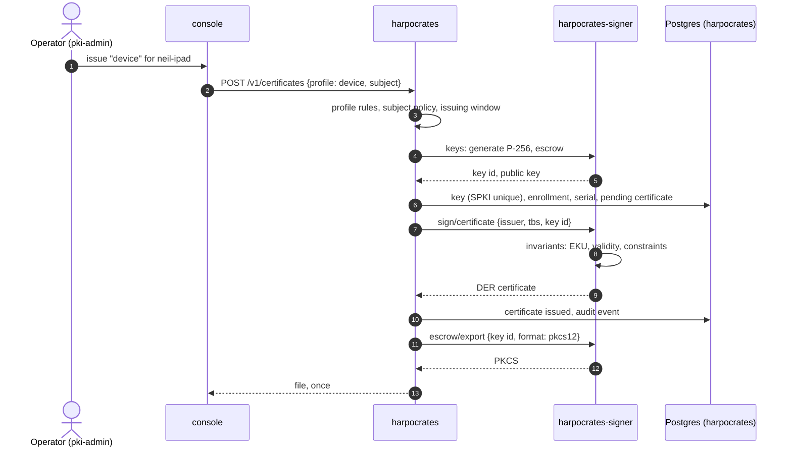
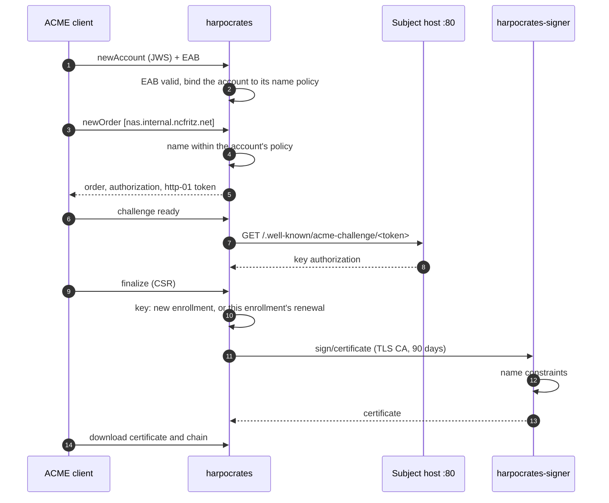
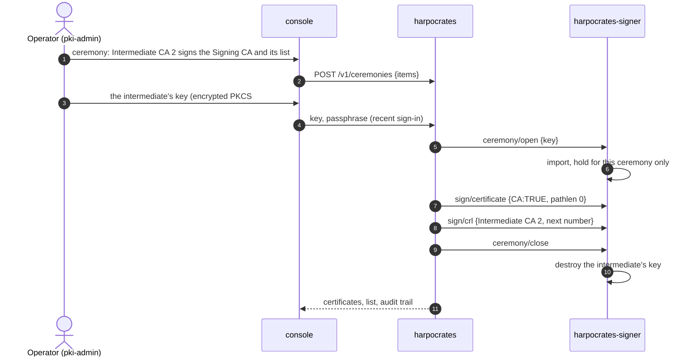

# 0020. An internal certificate authority: Harpocrates

- **Status:** Accepted
- **Date:** 2026-09-21; amended and accepted 2026-09-25

## Context

Every certificate behind ADR 0018 is issued by hand in XCA
([runbook](../guides/certificates.md)): keys generated on a laptop,
revocation lists exported on every revocation and at least monthly, and
nothing renewed unless someone remembers. ADR 0018 named step-ca as the
later replacement. What is needed from it:

- Private key generation and management, CSR generation and signing,
  renewal, revocation lists, and ACME for anything that can speak it.
- A UI for managing issuers, profiles, certificates and ACME accounts,
  and an API documented with OpenAPI, like the rest of the platform.
- SSH certificates for users and hosts, and certificates for signing
  code, mail and documents.
- Seeing what expires, and being told before it does.
- Everything local; nothing depends on a cloud service.

What was found (September 2026):

- **step-ca's revocation is passive by design**: revoking a certificate
  blocks its renewal and it stays valid until it expires. Revocation
  lists are secondary and there is no OCSP responder. Every relying
  party here (the API's `3443`, the NAS nginx) checks a revocation list,
  so step-ca would be the wrong fit for the part that matters most.
- **Issuance is well served in Node**: `@peculiar/x509` and `pkijs` are
  maintained and cover keys, CSRs, certificates and extensions. The gaps
  are PKCS#12 export (legacy `node-forge`) and assembling signed CRLs and
  OCSP responses from primitives.
- **Python's `cryptography`** has first-class builders for certificates,
  CSRs, CRLs, OCSP responses and PKCS#12 (including the legacy
  encryption some devices require).
- **No maintained ACME server library exists in either language.** The
  Node packages are clients; `@peculiar/acme-server` was last published
  in April 2024. The ACME server is ours to write.
- The internal zone is served by the router, which has no API for TXT
  records, so ACME's `dns-01` challenge is not available for internal
  names.
- The one device on the LAN with unusual needs is the HP Color LaserJet
  Pro MFP M479fdw: HP's embedded web server is known to be particular
  about imported PKCS#12 files (key type, encryption, whether the chain
  is included).

## Decision

### Build it; two services

The CA is ours, split so that private keys live in one small process
that makes almost no decisions:

| Service              | Language         | Holds                                           | Does                                                                                            |
| -------------------- | ---------------- | ----------------------------------------------- | ----------------------------------------------------------------------------------------------- |
| `harpocrates`        | NestJS           | Metadata: issuers, profiles, certificates, ACME | Management API, ACME, renewal, policy, CRL scheduling and publication                           |
| `harpocrates-signer` | Python (FastAPI) | Private keys, encrypted                         | Generate keys, sign certificates, SSH certificates, CRLs and KRLs, export PKCS#12; nothing else |
| console              | Next.js          | Nothing                                         | The operator's view, on Olympus Control (below)                                                 |

`harpocrates` never sees a private key except one it is handing to the operator
once (see Enrollment). `harpocrates-signer` never decides _whether_ a certificate
should exist, only whether it breaks one of its own invariants.

This is a new top-level domain, **Harpocrates** (`docs/conventions/general.md`:
new domains get an ADR), after the god of silence and secrets: the
platform's PKI. Its OpenAPI document is `/harpocrates`.

### Naming and layout

The domain's name is its components' identity: directories, packages,
images, containers, the Compose stack, volumes, secrets, the OpenAPI
document, the SDK client, the proxy path and metric names. What is
written into certificates and tokens stays functional, because it
outlives the implementation: the distribution host
`pki.internal.ncfritz.net` and the roles `pki-admin` and `pki-operator`.

The services and the console are one system, built, versioned and
deployed together, so they share a directory, as an agent and its console
do (ADR 0016):

```
apps/harpocrates/
  README.md            how the parts fit: socket, token, ports, dev loop
  docker-compose.yml   development only: harpocrates-postgres
  .run/                git-ignored: the signer's socket and dev store
  service/             @ncfritz/harpocrates-service   NestJS, Prisma
    openapi/harpocrates.json   the management API; the SDK's client
  signer/              @ncfritz/harpocrates-signer    FastAPI, uv
    openapi/signer.json        the signer's API; a client internal to service/
  console/             @ncfritz/harpocrates-console   Next.js, on packages/console
```

- The workspace includes `apps/harpocrates/*` by name, not `apps/*/*`,
  so no other app is nested by accident.
- The service's client for the signer is generated from the signer's
  committed document and committed with it (`src/generated/signer`), so
  building the service, locally or in its image, never needs Python.
  `check:conventions` regenerates it and fails on a difference, as
  `check:openapi` does for the documents: a change to the signer's API
  fails the check, not the service at runtime.
- The signer is a single `uv` project. A root `uv` workspace waits for a
  second Python project.

**The signer is the one exception to "TypeScript everywhere".** It is kept
small enough to read in a sitting, because Python's `cryptography` is
materially ahead for the revocation lists, PKCS#12 and (later) OCSP this
design depends on, and because the boundary is the point: a narrow
signing API is what an HSM would give us, drawn in software.

### The signer

- **Transport: a Unix socket**, on a volume only `harpocrates` and the
  signer mount. No network listener at all, so nothing else on any Docker
  network can reach it, and there is no certificate to bootstrap before
  the CA exists. A shared token (a Compose secret) is checked as well.
- **API**: `status`, `unseal`, `seal`, `keys` (generate; import),
  `sign/certificate`, `sign/crl`, `sign/ssh`, `sign/krl`,
  `escrow/export`, and ceremonies for offline CAs (`ceremony/open`,
  `ceremony/close`). Inputs are fully formed: subject, extensions,
  validity, serial and the public key or CSR. It has its own OpenAPI
  document; `harpocrates` calls it through a generated client that is
  not part of `packages/sdk`.
- **Invariants it enforces itself**, whatever `harpocrates` asks:
  - The issuer's name constraints, checked against every name in the
    request.
  - A maximum validity per issuer, and never past the issuer's own
    expiry.
  - The extended key usages each issuer may sign (below).
  - `CA:TRUE` only from an offline CA in a ceremony, with a path length
    below its own: an online key never signs a CA.
  - An offline CA's key is held for one ceremony at most, and never
    across a restart.
- **Storage**: its own SQLite file on its own volume. Keys are never in
  Postgres, and a dump of the platform database holds nothing that signs.

### Key protection: encrypted, unsealed automatically

- Each private key is encrypted with its own data key (AES-256-GCM). The
  data keys are wrapped by a master key, and the master key is wrapped
  twice:
  - by the **unseal key**, 32 random bytes in a Compose secret
    (`harpocrates_signer_unseal_key`, ADR 0019) that only the signer
    mounts;
  - by a **recovery passphrase** (Argon2id), kept in the password
    manager and nowhere on the host.
- **The signer unseals itself at start** with the unseal key, so the CA
  survives an unattended reboot of the Mac Mini. If the secret is missing
  or wrong it starts sealed and alerts, and the recovery passphrase
  unseals it (console or CLI).
- **Sealing is deliberate**: `seal` (a suspected compromise, a lost
  backup) forgets the keys and records the seal in the store, so the
  signer stays sealed across restarts until it is unsealed with the
  recovery passphrase. The unseal key alone does not undo it.
- While sealed, issuance, renewal, ACME finalisation and CRL signing
  return `503`; scheduled CRL signing retries and alerts. Everything
  read-only keeps working.
- Rotating the unseal key or the passphrase rewraps the master key;
  nothing else changes.
- **The cost**: whoever can read both the Mac Mini's secrets directory
  and the signer's volume has the online issuers, as they would have the
  API's signing keys (ADR 0018) today. What bounds it: the store and the
  unseal key are never in the same backup; the online issuers are
  name-constrained as they are reissued; the offline CAs are not on the
  host at all and can revoke and reissue every issuing CA. Losing the
  passphrase is harmless while the unseal key exists; losing both loses
  the online issuing CAs, which the intermediates reissue.

### Hierarchy

Three tiers, as XCA holds them today ([the certificates
guide](../guides/certificates.md)): a root, intermediates that sign only
CAs, and issuing CAs with path length 0 that sign everything else. The
[capabilities review](../plans/internal-ca/capabilities.md) has the
detail behind this section and the next four.

```
ncfritz.net Root CA 1                          offline
├── ncfritz.net Intermediate CA 1              offline
│   ├── ncfritz.net Issuing CA 1 - G1          online   network devices (existing)
│   ├── ncfritz.net Issuing CA 2 - G1          online   servers (existing)
│   └── ncfritz.net TLS Issuing CA 1 - G1      online   new: internal hosts, ACME
└── ncfritz.net Intermediate CA 2              offline
    ├── ncfritz.net Device Issuing CA 1        online   Olympus Devices (existing)
    ├── ncfritz.net Service Issuing CA 1 - G1  online   Olympus Services (existing)
    └── ncfritz.net Signing Issuing CA 1 - G1  online   new: code, mail, documents
```

**CAs that sign CAs are offline, held by Harpocrates.** The root's and
the intermediates' keys are outside the signer except during a
**ceremony**: imported (encrypted PKCS#8), used to sign what the
operator lists (an issuing CA, a list, a cross-signed successor), and
destroyed again whether the ceremony succeeds or not. Between ceremonies
each is encrypted on offline media and in the password manager, under
its own passphrase. Creating an offline CA is a ceremony that ends with
that export. The existing root and intermediates are imported from XCA
the same way, with everything they issued and their CRL numbers, so
**XCA is retired** without a new root or anything reissued. Only issuing
CAs are online, in the signer's store.

| Issuing CA               | Status                           | Signs                                                   | Extended key usage                    | Trusted by                      |
| ------------------------ | -------------------------------- | ------------------------------------------------------- | ------------------------------------- | ------------------------------- |
| **Service Issuing CA 1** | Existing; key imported from XCA  | Service identities; the API's `3443` certificate        | client, server                        | The API's `3443` (clients)      |
| **Device Issuing CA 1**  | Existing; key imported from XCA  | People's devices                                        | client                                | The NAS nginx                   |
| **Issuing CA 1, 2 - G1** | Existing; imported, closed       | What they issued stays tracked until it expires         | as issued                             | Everything that trusts the root |
| **TLS Issuing CA 1**     | New; key generated in the signer | Server certificates for internal hosts, ACME or by hand | server                                | Everything that trusts the root |
| **Signing Issuing CA 1** | New; key generated in the signer | Code, mail and documents                                | code signing, email, document signing | Per purpose, on each device     |

ADR 0018's Olympus Services and Olympus Devices are Service Issuing CA 1
and Device Issuing CA 1. Below, the issuing CAs are called by purpose:
the Service, Device, TLS and Signing CAs.

- **The TLS CA is name-constrained**: permitted DNS subtrees
  `internal.ncfritz.net` (and the LAN's IP ranges); everything else is
  excluded. The root is installed on laptops and phones; a constrained
  issuer cannot mint `google.com` even if the Mac Mini is lost. It is
  separate from the Service CA so an ACME-issued certificate can never
  be presented to the API's `3443` as a service. It takes over from
  Issuing CA 2 - G1 for new server certificates; Issuing CA 1 and 2 are
  imported closed (they issue nothing new) and retire with their last
  certificate.
- **The Signing CA** issues nothing valid for TLS, and nothing the TLS
  issuers issue can sign code or mail. Its name constraints permit the
  owned mail domains for `rfc822Name`.
- The existing CAs are not name-constrained and cannot become so without
  reissuing them and everything they signed; that is left for their
  successors (Open).
- Everything is ECDSA P-256, as ADR 0018 set. Subject keys may be RSA
  where a device requires it (the printer).

**Naming** follows XCA's existing pattern, made regular:
`CN = ncfritz.net [<purpose>] <tier> CA <n> - G<generation>`,
`O = ncfritz.net`. The tier is `Root`, `Intermediate` or `Issuing`; the
purpose (`TLS`, `Service`, `Device`, `Signing`, `SSH User`, `SSH Host`)
names what an issuing CA is for; `n` tells apart CAs of the same purpose
and tier; the generation counts successors, so a successor keeps `n` and
takes the next `G`. A subject is never reused, by a successor or after
revocation: chain building matches issuers by name. Each CA has a slug,
the same parts in lower case (`tls-issuing-1-g1`), used in its URLs and
metrics. The existing CAs keep their names; one without a generation is
its first. Because a successor's name differs, the API's
`AUTH_SERVICES_ISSUER` (ADR 0023) lists both names during a rollover.

**Longevity.** A CA stops issuing when a certificate of the longest
validity it issues, plus 30 days, no longer fits in its remaining life
(its **issuing window**), and its successor exists before then.

| Tier         | Key     | Validity | Successor made | Path length |
| ------------ | ------- | -------- | -------------- | ----------- |
| Root         | offline | 20 years | at 10 years    | 2           |
| Intermediate | offline | 10 years | at 6 years     | 1           |
| Issuing      | online  | 5 years  | at 3 years     | 0           |

A request near the end of a window goes to the successor rather than
getting a short certificate. A root's successor is cross-signed by the
old root in a ceremony, so devices that have only the old root keep
working.

### SSH certificate authorities

OpenSSH certificates have no chains, so SSH has two flat, online CAs in
the signer, never sharing a key: **ncfritz.net SSH User CA 1 - G1** (hosts
trust it with `TrustedUserCAKeys`) and **ncfritz.net SSH Host CA 1 - G1**
(clients trust it with `@cert-authority`). Rotation is a new generation
trusted beside the old. Revocation is a KRL per CA, published beside the
CRLs; user certificates are short enough that it is rarely needed.

### Profiles

A profile is what a certificate may be: issuer, key type, key usage and
extended key usage, subject and SAN rules, validity, enrollment mode,
maximum key age and export format. Every issuance names one; its issuer
is the default, and the operator may choose another only among CAs that
could sign it (online, unsealed, inside their issuing window, allowing
its EKUs, and whose constraints admit its names). Initial set:

| Profile         | Issuer      | Key      | Validity | Enrollment             | Notes                                                                  |
| --------------- | ----------- | -------- | -------- | ---------------------- | ---------------------------------------------------------------------- |
| `service`       | Service CA  | P-256    | 1 year   | CSR or generated       | CN = app name, OU = deployment (ADR 0018)                              |
| `api-server`    | Service CA  | P-256    | 1 year   | CSR or generated       | The API's `3443`                                                       |
| `device`        | Device CA   | P-256    | 1 year   | generated              | PKCS#12 for iOS profiles and browsers                                  |
| `internal-tls`  | TLS CA      | P-256    | 90 days  | ACME, CSR or generated | Renewed at 60 days                                                     |
| `legacy-device` | TLS CA      | RSA 2048 | 1 year   | generated              | The printer: PKCS#12 without the chain, legacy (SHA-1/3DES) encryption |
| `code-signing`  | Signing CA  | P-256    | 2 years  | CSR                    | Renewed at 18 months; re-sign what it signed                           |
| `email`         | Signing CA  | P-256    | 2 years  | generated              | S/MIME; escrowed, since a lost key loses mail                          |
| `document`      | Signing CA  | P-256    | 2 years  | CSR or generated       | RFC 9336 document signing; re-sign before expiry                       |
| `ssh-user`      | SSH User CA | Ed25519  | 16 hours | public key             | Principals from the operator's identity                                |
| `ssh-host`      | SSH Host CA | Ed25519  | 90 days  | public key             | Hostnames as principals; renewed like `internal-tls`                   |

There is no timestamping authority: signing certificates are renewed
early and what they signed is re-signed before they expire.

### Keys and enrollment

**One key, one request, many certificates.** A key is bound to exactly
one **enrollment**, the request that introduced it (its CSR, subject,
names and profile); the enrollment's certificates are its first issue and
every renewal.

- Every key's SubjectPublicKeyInfo hash is unique across Harpocrates
  (CA, subject and SSH keys, generated or submitted). A CSR whose key
  belongs to another enrollment is refused, as is a CA's key as a
  subject key.
- **Renewal may keep the key** (a renewal over mTLS without a CSR, or an
  ACME `finalize` with the enrollment's key, names and profile) up to
  the profile's maximum key age (2 years by default), or **rekey**,
  which starts a new enrollment linked to the old.
- Submitted keys are checked against the known weak keys (Debian, ROCA,
  close primes). A key revoked for `keyCompromise` is blocked for good
  and every certificate in its lineage is revoked, as the CA/Browser
  Forum's Baseline Requirements (§6.1.1.3) require of public CAs.

Two enrollment modes, per profile:

- **CSR** (preferred): the subscriber generates its key and submits a
  CSR. The CA never has the key.
- **Generated, and escrowed**: the signer generates the key, the
  certificate is issued, and the key is kept, wrapped by its own data
  key like the issuers' keys. It can be exported again (PKCS#12 or PEM)
  by someone holding `pki-admin`, with a reason, after a recent sign-in
  (the access token's `auth_time`, ADR 0018), and recorded in the audit
  log. This is for devices that cannot generate a CSR, or where
  re-downloading a lost file matters more than the key never having
  existed outside the device. For `serverAuth` this departs,
  deliberately, from what the Baseline Requirements allow public CAs:
  the printer cannot make a CSR.

Escrowed keys are subject to the seal like everything else, live as long
as their lineage, and are deleted when its last certificate is revoked or
has been expired for a year. A generated key whose request never issued
is deleted after a day.

### Serials, revocation and publication

- **Serials** are 159 random bits (positive, 20 bytes), allocated in the
  transaction that records the certificate, with a unique constraint.
  Certificates imported from XCA keep theirs.
- **Revocation lists** are signed per issuer, numbered monotonically
  (continuing from XCA's last number), valid for **7 days** and
  republished **daily** and on every revocation. An expired list is
  treated as no list, so expiry, not corruption, is the failure to
  design against.
- **Publication** writes the DER list, the issuer's certificate and the
  SSH CAs' KRLs to a `harpocrates-published` volume, then fetches each
  back through its distribution URL and verifies the signature before
  recording it as published. A failure alerts.
- **Distribution**: the Mac Mini nginx serves that volume at
  `http://pki.internal.ncfritz.net/crl/<slug>.crl`, `/ca/<slug>.crt` and
  `/krl/<slug>.krl`. Plain HTTP on purpose (fetching a CRL must not
  depend on a certificate the CA issued), no authentication, no
  redirects. The URLs are written into every new certificate (CRL
  distribution point, authority information access), so the name is
  dedicated and outlives the host: it moves with the CA if the CA moves.
- **Relying parties keep reading files**, as ADR 0018 set:
  - The API mounts `harpocrates-published` read-only and points
    `TLS_CRL_SERVICES` at the lists of every CA in the Service CA's
    chain (the Service CA, Intermediate CA 2, the root); it already
    reloads them when they change.
  - The NAS pulls the Device CA's chain's lists from the distribution URL
    on a schedule, checks the signatures, concatenates them for
    `ssl_crl`, and reloads nginx. Pull, so the CA needs no credentials
    for the NAS.
- **The offline CAs' lists** (the root's and each intermediate's) are
  signed in a ceremony with a 13-month validity, once a year and
  whenever a CA below them is revoked. An alert fires two months before
  one lapses: a lapsed list breaks every relying party beneath it.
- Revoking a CA does not revoke what it issued; the console lists what
  is affected and offers to reissue it from a successor.
- OCSP is not provided, nor certificate hold; every relying party is
  ours and uses lists.

### Renewal and delivery

- **Services, devices and SSH hosts** renew over mutual TLS: presenting
  a current, unrevoked certificate from the same issuer to
  `POST /v1/renew` on `9443`, with a CSR (or with none, keeping the key)
  returns a certificate with the same subject. `harpocrates` checks
  status from its own records, not a revocation list.
- **ACME** subscribers renew as ACME clients do.
- **Deploy targets**, per certificate, run on issue and renewal for what
  can do neither: write to a host path and reload nginx, DSM through its
  API, the printer through its embedded web server. After a deploy, and
  on a schedule, the service connects to the endpoint and records which
  certificate it actually serves.
- Downloads: PEM, chain, DER, and PKCS#12 (modern, or legacy for
  `legacy-device`) where the key is escrowed.

### ACME

RFC 8555, implemented in `harpocrates` (NestJS, `jose` for JWS), for the
TLS CA only.

- Directory at `https://pki.internal.ncfritz.net:9443/acme/directory`;
  accounts, orders, authorizations, `http-01` and `tls-alpn-01`
  challenges, finalisation, certificate download and revocation. Nonces
  are a table with a short expiry.
- **External Account Binding is required.** An EAB credential is created
  in the console and carries a name policy (the names or subtrees its
  account may request). Without it, anything on the LAN that can reach
  the endpoint could obtain a certificate for any internal name, and the
  root is trusted by every browser in the house.
- An order is checked against its account's policy before any challenge
  is created; the signer checks the name constraints again at signing.
- ACME Renewal Information (RFC 9773) is offered, so a rollover or a
  compromise can bring renewals forward.
- `dns-01` is not offered until the internal zone, or a delegated
  `_acme-challenge` zone, has an API (Open).
- Checked against certbot, lego, acme.sh and Caddy, which each exercise
  different corners of the protocol.

### Surfaces

| Surface        | Where                                               | Auth                                                           | Documented                  |
| -------------- | --------------------------------------------------- | -------------------------------------------------------------- | --------------------------- |
| Console        | `control.olympus.ncfritz.net/harpocrates/ca`        | Olympus Control sign-in (ADR 0021, 0018)                       | This ADR                    |
| Management API | nginx → `harpocrates`, `/harpocrates/ca/api/v1/...` | JWT from the API (ADR 0018), roles `pki-admin`, `pki-operator` | OpenAPI `/harpocrates`; SDK |
| Renewal        | `harpocrates` `:9443`, `/v1/renew`                  | Client certificate                                             | OpenAPI `/harpocrates`      |
| ACME           | `harpocrates` `:9443`, `/acme/...`                  | JWS; EAB at registration                                       | RFC 8555                    |
| Distribution   | Mac Mini nginx, `http://pki.internal.ncfritz.net/`  | None                                                           | This ADR                    |
| Signer         | Unix socket                                         | Shared token                                                   | Internal OpenAPI            |

- Every console action is an API operation; the console has no other
  way in, so anything done by hand can be scripted.
- ACME and renewal are on `9443`: HTTPS with a certificate from the TLS
  CA, asking for (not requiring) a client certificate; each route
  decides what it accepts. Published on the LAN directly, like the API's
  `3443`, because renewal needs the client certificate a proxy would
  end.
- `harpocrates` verifies users' JWTs against the API's JWKS; it does not
  issue tokens or touch the auth tables.
- **Break-glass**: CLIs inside the containers can unseal, issue and
  revoke without the console or the API, so an expired certificate on
  the API can always be replaced.

### The console

**Harpocrates is a property of Olympus Control** (amending ADR 0021),
beside Olympus, Dionysus and Minerva, with one console for now:

| Console | Path              | API                   | Image                    |
| ------- | ----------------- | --------------------- | ------------------------ |
| CA      | `/harpocrates/ca` | `/harpocrates/ca/api` | `harpocrates-ca-console` |

It lives in `apps/harpocrates/console`, beside the service and the
signer, because it is built and deployed with them (also amending ADR
0021, whose rule put a console without an agent in
`apps/<name>-console`). It replaces the PKI area once planned for
`apps/site`: the CA must not depend on the site to be managed. Its pages:
a dashboard; the CA tree, with each CA's issuing window and list
status; certificates (search, detail, chain, issue, renew, revoke,
download, deploy targets, escrow export); profiles; SSH; ACME accounts
and EAB credentials; ceremonies; the audit log. The seal state is on
every page.

### Monitoring

- **Alerting is the monitoring stack's**, so it never depends on the CA
  being up. Harpocrates exports `certificate_expiry_days` for everything
  it knows, the next update of each list, each CA's issuing window, the
  seal state, and renewal, publication and deploy failures;
  Alertmanager rules page on them, with thresholds per profile.
- **Seeing is the console's**, from the service's own records: expiry
  as time remaining on every certificate, banded, with whether it renews
  itself or needs a person; a dashboard of what expires over the next 90
  days, what needs a person, the issuing windows, the lists and the seal;
  and deployed-versus-issued from the endpoint checks.
- A certificate's owner may be reminded through the Olympus notification
  agent for what only a person can do, best effort: the CA never waits
  on the platform.

### Audit

Append-only and hash-chained: each event carries the hash of the one
before, and `harpocrates audit verify` checks the chain. Every surface
writes to it: CAs and ceremonies, key generation, import, export and
destruction, requests (and refusals, with the reason), issuance,
renewal, revocation, lists signed and published, seal and unseal,
configuration changes, ACME accounts, credentials, orders, challenges
and revocations, and authentication failures, each with its principal
and surface.

### Data

`harpocrates` keeps its own Postgres, a container in the `harpocrates`
stack, with migrations in Prisma (as Minerva calendar sync does). It is
not the data stack's Postgres, is not tracked by Hasura, and the API is
not its client.

- The CA issues the API's own certificates, so it must not depend on
  the API or Hasura to do so.
- ADR 0019 keeps Postgres on `data` reachable only from Hasura; a
  separate instance leaves that rule alone and puts the CA's whole state
  (database and signer store) in one stack, backed up together.
- ADR 0007 holds: tables, columns, foreign keys and constraints; no JSON
  documents in rows.
- Tables: `issuers`, `ceremonies`, `profiles`, `keys` (SPKI hash,
  unique), `enrollments`, `certificates` (serial, issuer, profile,
  enrollment, subject, SANs, validity, status), `ssh_certificates`,
  `revocations`, `crls`, `krls`, `deploy_targets`, `deployments`,
  `endpoint_observations`, `escrow_exports`, `acme_accounts`,
  `acme_eab_credentials`, `acme_name_policies`, `acme_orders`,
  `acme_authorizations`, `acme_challenges`, `acme_nonces`,
  `audit_events`.

### Deployment

- The Mac Mini, in a fifth Compose stack, `harpocrates` (ADR 0019):
  `harpocrates`, `harpocrates-signer`, `harpocrates-postgres` and the
  console, a private network, the signer's store and socket volumes, and
  `harpocrates-published` shared with nginx and the API. Separate from
  `olympus` so a platform deploy never restarts, and so never seals, the
  CA.
- `harpocrates` and its console join `edge`, so nginx can proxy them on
  the control host.
- Backups: the signer's SQLite file (encrypted keys) and the
  `harpocrates` database, together. The unseal key is not in that
  backup: it lives in the host's secrets and, with the recovery
  passphrase, in the password manager. The offline CAs' exported keys are on
  offline media, never in a backup of the host.
- A second host later changes where the stack runs and what
  `pki.internal.ncfritz.net` resolves to, nothing else.

## Diagrams

### Overview


```mermaid
flowchart LR
  subgraph Offline
    ROOT["Root and intermediate keys<br/>offline media, password manager"]
  end
  subgraph MacMini["Mac Mini"]
    subgraph HARP["harpocrates stack"]
      APP["harpocrates (NestJS)<br/>management API, ACME, renewal<br/>:9443 LAN"]
      SIG["harpocrates-signer (Python)<br/>keys, unsealed at start"]
      CON["console<br/>/harpocrates/ca"]
      DB[("harpocrates-postgres")]
      PUB[("harpocrates-published")]
    end
    NGX["nginx<br/>http://pki.internal.ncfritz.net<br/>control host"]
    API["API :3443<br/>TLS_CRL_SERVICES"]
  end
  subgraph NAS
    EDGE["nginx<br/>ssl_crl"]
    PULL["CRL pull job"]
  end
  MON["monitoring<br/>Prometheus, Alertmanager"]
  ACMEC["ACME clients<br/>nginx, DSM, Caddy"]
  AGENTS["agents, devices, SSH hosts"]

  ROOT -. "ceremony: issuing CAs, offline CAs' lists" .-> SIG
  APP -- "Unix socket" --> SIG
  APP --> DB
  APP -- "CRLs, KRLs, CA certs" --> PUB
  PUB --> NGX
  PUB -. "read-only" .-> API
  PULL -- "HTTP" --> NGX
  PULL --> EDGE
  CON -- "JWT (via nginx /harpocrates/ca/api)" --> APP
  ACMEC -- "ACME + EAB" --> APP
  AGENTS -- "renew, mTLS" --> APP
  MON -- "scrape /metrics" --> APP
```

### Issuing with an escrowed key


```mermaid
sequenceDiagram
  autonumber
  actor O as Operator (pki-admin)
  participant S as console
  participant P as harpocrates
  participant G as harpocrates-signer
  participant D as Postgres (harpocrates)

  O->>S: issue "device" for neil-ipad
  S->>P: POST /v1/certificates {profile: device, subject}
  P->>P: profile rules, subject policy, issuing window
  P->>G: keys: generate P-256, escrow
  G-->>P: key id, public key
  P->>D: key (SPKI unique), enrollment, serial, pending certificate
  P->>G: sign/certificate {issuer, tbs, key id}
  G->>G: invariants: EKU, validity, constraints
  G-->>P: DER certificate
  P->>D: certificate issued, audit event
  P->>G: escrow/export {key id, format: pkcs12}
  G-->>P: PKCS#12 (passphrase from the operator)
  P-->>S: file, once
```

### ACME order


```mermaid
sequenceDiagram
  autonumber
  participant C as ACME client
  participant P as harpocrates
  participant H as Subject host :80
  participant G as harpocrates-signer

  C->>P: newAccount (JWS) + EAB
  P->>P: EAB valid, bind the account to its name policy
  C->>P: newOrder [nas.internal.ncfritz.net]
  P->>P: name within the account's policy
  P-->>C: order, authorization, http-01 token
  C->>P: challenge ready
  P->>H: GET /.well-known/acme-challenge/<token>
  H-->>P: key authorization
  C->>P: finalize (CSR)
  P->>P: key: new enrollment, or this enrollment's renewal
  P->>G: sign/certificate (TLS CA, 90 days)
  G->>G: name constraints
  G-->>P: certificate
  C->>P: download certificate and chain
```

### A ceremony


```mermaid
sequenceDiagram
  autonumber
  actor O as Operator (pki-admin)
  participant S as console
  participant P as harpocrates
  participant G as harpocrates-signer

  O->>S: ceremony: Intermediate CA 2 signs the Signing CA and its list
  S->>P: POST /v1/ceremonies {items}
  O->>S: the intermediate's key (encrypted PKCS#8) and its passphrase
  S->>P: key, passphrase (recent sign-in)
  P->>G: ceremony/open {key}
  G->>G: import, hold for this ceremony only
  P->>G: sign/certificate {CA:TRUE, pathlen 0}
  P->>G: sign/crl {Intermediate CA 2, next number}
  P->>G: ceremony/close
  G->>G: destroy the intermediate's key
  P-->>S: certificates, list, audit trail
```

## Consequences

- XCA is retired: the root, the intermediates and their history move
  into Harpocrates, and the keys of CAs that sign CAs are only ever on
  offline media or inside a ceremony. Each ceremony needs the media and
  a passphrase, a few times a year at most.
- Revocation becomes routine: revoke in the console and every relying
  party has the new list within minutes (the API) or one pull interval
  (the NAS). The monthly export by hand goes away.
- Internal servers get ACME, services, devices and SSH hosts get
  renewal, and the printer and DSM get deploy targets. Adding a device
  is an issuance in the console.
- SSH moves from keys in `authorized_keys` to short user certificates
  and host certificates.
- Code, mail and documents can be signed by a CA the devices trust; what
  is signed has to be re-signed before its certificate expires.
- The platform gains a Python service, with its own toolchain in the
  monorepo (`uv`, `ruff`, `pyright`, `pytest`, wired into Turbo tasks),
  and a conventions document for it (`docs/conventions/python.md`).
- Writing the ACME server is the largest single piece of work.
- The CA shares the Mac Mini with what it vouches for: losing that host
  loses both. Accepted for now; a second host moves the `harpocrates`
  stack.
- A restart of the host needs nobody: the signer unseals itself. The CA
  being sealed (the secret missing, or a deliberate seal) is visible, a
  metric and an alert, not silent.
- ADR 0021 gains a property (Harpocrates) and loses the Olympus CA
  console; a console built with its service may live in that service's
  directory.
- The runbook ([certificates](../guides/certificates.md)) is rewritten for
  the console and the ceremonies.
- Replaces ADR 0018's "later: step-ca" item. The rest of ADR 0018
  stands: the same intermediates, relying parties and file-based
  revocation lists.

## Open

- Name constraints on the Service and Device CAs when their
  successors are made.
- `dns-01`: delegate `_acme-challenge.internal.ncfritz.net` to an
  acme-dns instance, or move the internal zone off the router.
- Device enrollment for iOS by SCEP in a configuration profile, instead
  of a PKCS#12 file.
- The printer's firmware: which key types and PKCS#12 encryption it
  accepts, confirmed on the device before `legacy-device` is settled.
- A hardware key store (a YubiKey or PKCS#11 token) behind the signer's
  key interface, the offline CAs' first.
- Discovery: the endpoint check pointed at the LAN, to find certificates
  Harpocrates did not issue.
- A timestamping authority, if re-signing becomes a burden.

## Implementation

The phases are in [docs/plans/internal-ca](../plans/internal-ca/README.md);
the review behind the 2026-09-25 amendments is
[capabilities.md](../plans/internal-ca/capabilities.md).

## References

- https://smallstep.com/docs/step-ca/revocation/
- https://datatracker.ietf.org/doc/html/rfc8555
- https://datatracker.ietf.org/doc/html/rfc9773
- https://datatracker.ietf.org/doc/html/rfc9336
- https://cabforum.org/working-groups/server/baseline-requirements/
- https://cryptography.io/en/latest/x509/reference/
- https://cryptography.io/en/latest/hazmat/primitives/asymmetric/serialization/#ssh-certificates
- https://github.com/PeculiarVentures/x509
